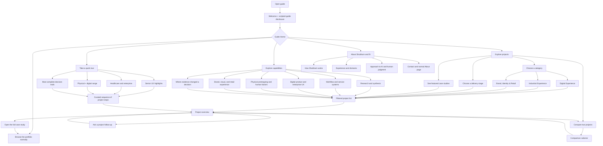
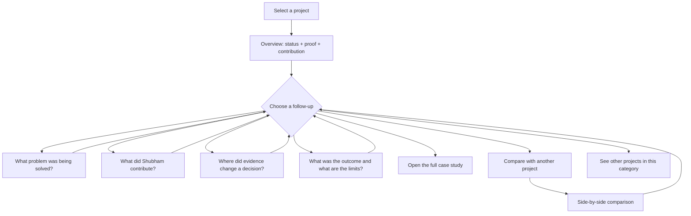
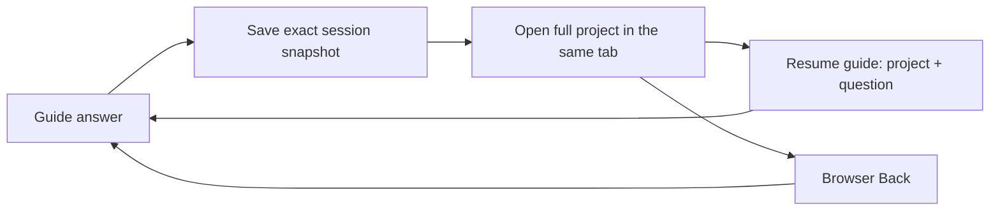

# Curated portfolio guide: conversation architecture

- **Proposed:** 4 August 2026
- **Status:** Future-state design for review; no site implementation yet
- **Experience label:** Guided portfolio
- **Optional expressive name:** Ask the Archive
- **Technical model:** Deterministic, route-backed static decision graph with predefined prompts and answers
- **Companion:** [Minimal content script](./2026-08-04-curated-portfolio-guide-minimal-content-script.md)

## Decision summary

Build an optional conversational guide over the existing portfolio rather than replacing normal navigation. The guide should look and behave like a focused conversation, but describe itself honestly:

> Choose from prepared questions and evidence-linked answers. This is a scripted guide, not live AI or free-form chat. Your choices are not sent to an AI service.

The experience has no free-text input in version one. Visitors choose authored questions, receive concise sourced answers, and can move into a category, a project, a comparison, a full case study, or normal browsing. It requires no model, API key, database, or paid service and is compatible with static GitHub Pages.

The central navigation rule is a route-backed history stack: every choice adds one step; **Back** removes one step; **Guide Home** opens the main topics without erasing the current journey; **Close guide** returns to the page from which the visitor entered and preserves the current step for the browser session; and **Start over** clears it.

## Scope and assumptions

This is an assumption-led future-state journey, not a finding from user research.

- **Primary visitor:** a recruiter or hiring manager scanning for senior-UX fit in roughly three to eight minutes.
- **Secondary visitor:** a design peer or collaborator exploring methods, evidence, and multidisciplinary range.
- **Start:** the visitor opens the guide from the homepage, a category, or a case study.
- **End:** the visitor opens a relevant case study, reaches the About or contact path, or returns to normal browsing.
- **Expected session:** two to ten minutes.
- **Version-one boundary:** predefined choices only; no free text, voice, generated content, account, or network request.
- **Canonical source:** sanitized, published portfolio content. The guide is an index into the portfolio, not a second source of truth.

## Experience anatomy

The guide should be a first-class full-page route across desktop and mobile, using the portfolio's existing hash-based navigation. This avoids a cramped floating widget, gives browser Back a meaningful role, and lets the visitor keep category, project, and question context visible. It contains four stable regions:

1. **Sticky utility header:** Back, Guide Home, Start over, and Close guide, followed by a breadcrumb-like location.
2. **Current step:** one focused prepared answer rather than a long imitation of an AI transcript.
3. **Evidence or result area:** project cards, exact maturity labels, proof lines, comparisons, or links.
4. **Next choices:** two to four contextual prompt buttons plus a normal-browse handoff when relevant.

The portfolio launcher can say **Explore with the guide**. If a session exists, its label can become **Resume your guide**. On small screens, keep all four utility labels visible in a two-row header with touch targets of at least approximately 44 px; do not hide essential navigation in an overflow menu.

## Global conversation map

All content nodes also retain the persistent Back, Guide Home, Start over, and Close guide actions. The diagram omits those repeated links for readability.

## Guide Home

The first meaningful screen should ask, **What would you like to understand?** and offer four primary choices:

1. **Give me a quick tour**
2. **Let me explore projects**
3. **Show me a capability**
4. **Tell me about Shubham**

**Browse the portfolio normally** is a visually quieter fifth action. It should always remain available, because the guide is an optional layer rather than the site's only information architecture.

### Quick-tour branch

Each tour is a short, authored sequence rather than an automated ranking. A stop contains one reason the project belongs in the tour, its exact status, one proof line, and two actions: **Next stop** and **Open this case study**. A progress label such as **2 of 4** sets expectations.

Recommended tours:

- **Senior UX highlights:** evidence-led decision making, systems work, execution, and multidisciplinary range.
- **Healthcare and enterprise:** the strongest public work related to healthcare, complex workflows, and reusable systems.
- **Physical + digital range:** a deliberate sequence across digital product, industrial design, and spatial/brand experience.
- **Most complete decision trails:** three concise examples where public evidence and a decision can be connected directly.

At completion, offer **Compare these projects**, **Choose another tour**, **About Shubham**, and **Browse all work**.

### Project-exploration branch

Visitors can enter by category, broad delivery stage, featured depth, or comparison. Broad delivery-stage labels are navigation aids only; every result card must still show the exact project status.

#### Category inventory

| Category                     | Projects and exact public status                                                                                                                                                                                                                                                         |
| ---------------------------- | ---------------------------------------------------------------------------------------------------------------------------------------------------------------------------------------------------------------------------------------------------------------------------------------- |
| **Digital Experience**       | Connection Customer to Support — **Implemented**; OneX: Unifying Healthcare — **Ongoing platform design**; Helping Patients Find Right Clinical Trials — **Prototype**; Font Readability Framework — **Shipped**; Royal Coffee: Personalised Coffee Experience — **Design-task concept** |
| **Industrial Experience**    | FireFlys — Early Wildfire Detection Drone — **Working prototype**; Zero Brush — **Functioning academic concept prototype**; Humanising LT-20 Classic — **Concept**; Planter Design: Dudhi Industries — **Manufactured and sold**; Philips Life Shield — **Internship concept**           |
| **Brand, Identity & Retail** | Nescafé Connected Coffee Mug — **Concept Proposal**; PRAG Marketing Posters — **Delivered**; PRAG Articove Brochure — **Delivered and printed**; Studio Portfolio Identity — **In progress**                                                                                             |

#### Broad delivery-stage menu

- **Delivered or realized work** maps to Shipped, Implemented, Manufactured and sold, Delivered, and Delivered and printed.
- **Ongoing work** maps to Ongoing platform design and In progress.
- **Prototypes** maps to Prototype, Working prototype, and Functioning academic concept prototype.
- **Concepts and proposals** maps to Design-task concept, Concept Proposal, Concept, and Internship concept.

These groupings must never rewrite a concept as shipped work or an ongoing design as an adopted outcome.

### Capability branch

Capability choices return a short framing answer followed by a curated project set. The visitor can then refine it with prompts such as **Show evidence-to-decision cases**, **Only show delivered work**, or **Compare two examples**.

The **Where did evidence change a decision?** choice should only return projects whose published case study contains a structured evidence-to-decision account. Other questions—**Quick proof**, **What was the challenge?**, **What did Shubham do?**, and **What resulted?**—can be offered across all projects.

### About-and-fit branch

This branch should answer bounded portfolio questions, not pretend to conduct an interview on Shubham's behalf. Suggested choices are:

- **How does Shubham work?**
- **Which domains has he worked in?**
- **How does he use AI with human judgment?**
- **Why might he fit a senior UX role?**
- **Open the About page or contact path**

Any claim about fit should point to projects or public profile evidence rather than use unsupported superlatives.

## Project conversation loop

The overview should be concise enough to scan in one viewport. A useful order is:

1. Project title and exact status
2. One-sentence reason it matches the chosen path
3. Public proof line
4. Shubham's role or contribution, when documented
5. **View full case study**
6. Contextual follow-up prompts

If a project does not publish a structured answer to a particular prompt, hide that prompt. If the gap is reached through an old link or unexpected state, say **That detail is not documented publicly** and offer the closest valid next actions.

## Navigation contract

| Action                   | Predictable behavior                                                                                                                                                                                                                             |
| ------------------------ | ------------------------------------------------------------------------------------------------------------------------------------------------------------------------------------------------------------------------------------------------ |
| **Back**                 | Removes one conversation node from the history stack and restores the previous answer, selections, scroll position, and keyboard focus. It never means “go to Guide Home.”                                                                       |
| **Guide Home**           | Opens the four main topics while preserving the current journey. Back returns to the point from which Home was opened.                                                                                                                           |
| **Close guide**          | Returns to the route and scroll position from which the guide was opened. The current node and history remain available for this browser tab, and focus returns to the launcher when possible. A direct guide link falls back to portfolio Home. |
| **Resume your guide**    | Reopens the exact preserved node after Close guide or after viewing another portfolio page in the same tab.                                                                                                                                      |
| **Start over**           | After a simple confirmation, clears the guide history and selections and returns to the welcome screen. Cleared states must not reappear through browser Back.                                                                                   |
| **Open full case study** | Hands off to the canonical project page and moves focus to its main heading. The guide session remains saved, and its launcher offers a return to the prior question.                                                                            |
| **Browse normally**      | Returns control to the ordinary portfolio navigation without losing the guide session.                                                                                                                                                           |
| **Browser Back**         | Mirrors visible Back while an internal guide step exists; after the first guide step, it exits to the page from which the guide was opened.                                                                                                      |

At Guide Home, Back remains visible but is disabled when no previous guide node exists. There are no dead ends: every answer provides supported follow-ups, **Open full case study**, **Browse this category**, or another canonical handoff in addition to the persistent utility actions.

### Same-state case-study handoff

Yes—the visitor can open the complete project and return to the exact guide state they left.

Before the project route opens, save the current guide route, node, history stack, selected category and project, question, tour position, answer scroll position, and focused control in `sessionStorage`. The project page then shows a quiet **Resume guide · [project or question]** launcher. Selecting it—or using browser Back—restores the same answer and history instead of restarting the guide.

Open the full project in the same tab by default. If a visitor explicitly opens it in a new tab, the original guide tab naturally remains unchanged; the design should not promise cross-tab state synchronization. Add a content-version key to the saved snapshot so an old state can fall back safely to Guide Home after a future deployment changes the guide graph.

## Conversation and state model

This is a graph of authored content nodes, not a chatbot transcript. Each node should define:

- a stable `id` and node type;
- a title and short answer blocks;
- zero or more evidence or project cards;
- two to four prompt choices, each with an explicit destination or action;
- source references to public portfolio sections;
- conditions that control whether a choice is shown;
- the preferred focus target when the node opens.

Recommended node types are welcome, topic menu, tour step, category menu, filtered project list, project overview, project evidence answer, comparison selector, comparison result, about answer, normal-browse handoff, and fallback.

The browser session needs only a small state object:

- `currentNodeId`
- `historyStack`
- `routeContext` — the portfolio page from which the guide opened
- `selectedCategory`
- `selectedProject`
- `comparisonProject`
- `quickTourVariant` and current tour step
- `entryRoute` and entry scroll position
- current answer scroll position and focused control
- `guideContentVersion`

Use session-only persistence. The guide does not need personal data, cookies, a server, or a cross-device identity. A project opened from the guide can use the existing public route while the session state stays in the browser.

### Recommended route shape

The current portfolio already uses hash-based routes, so these client-side paths remain compatible with static GitHub Pages:

| Guide state             | Route pattern                                          |
| ----------------------- | ------------------------------------------------------ |
| Welcome and main topics | `#/guide`                                              |
| Tour stop               | `#/guide/tour/:tourId/:step`                           |
| Project exploration     | `#/guide/projects`                                     |
| Category result         | `#/guide/category/:categorySlug`                       |
| Project overview        | `#/guide/project/:projectSlug`                         |
| Prepared project answer | `#/guide/project/:projectSlug/:questionId`             |
| Comparison              | `#/guide/compare/:firstProjectSlug/:secondProjectSlug` |
| About-and-fit answer    | `#/guide/about/:questionId`                            |

Each in-guide choice pushes a history entry. Guide Home also pushes `#/guide`, so Back can return to the prior answer. Start over clears session state and replaces the active guide history entry instead of adding another recoverable step.

A compact authored-answer record can use the shape `id`, `categoryId`, `projectId`, `prompt`, `answerBlocks`, `sourceHref`, `maturity`, and `followUpIds`. Build validation should reject missing projects, empty answers, broken public anchors, invalid follow-ups, and unsupported or altered maturity labels.

## Writing rules

- Call the controls **questions**, **topics**, or **choices**, not AI suggestions. Label responses **Prepared answer** or **From the case study**.
- Use first person only when the answer has been explicitly authored in Shubham's voice.
- Keep most answers between roughly 40 and 90 words before project cards.
- Show no more than four primary choices at once; use **More options** for longer sets.
- Avoid text inputs, send icons, chatbot avatars, fake typing, “thinking,” confidence scores, “Ask me anything,” or generated-looking delays. A short interface transition is enough.
- Repeat qualifiers such as Concept, Prototype, Ongoing, or anonymized in the visible answer; do not rely on card color.
- Link claims to the public case-study section that supports them.
- If the source does not support an answer, say so plainly rather than fill the gap.

## Trust, confidentiality, and accessibility

- Keep the scripted-guide disclosure in the welcome state and make it retrievable from an **About this guide** action.
- Use only published project content and public profile material. Never expose raw source notes, archives, private documents, hidden drafts, or unpublished metrics.
- Preserve OneX anonymization and do not imply adoption or realized revenue where the case study does not.
- Make every prompt and utility control a semantic keyboard-operable button or link with a visible focus state and no positive `tabindex`.
- On every route change, move focus to the new step heading without announcing the entire answer. On Close guide, restore focus and scroll to the original launcher when possible.
- Announce one completed answer per choice to assistive technology; do not announce text word by word.
- Respect reduced-motion preferences and avoid automatic sound or voice.
- At 200% text size and 320 CSS px, keep the utility header, cards, status labels, and prompt buttons readable without horizontal scrolling or obscured focus.
- Preserve normal navigation, headings, page landmarks, and case-study URLs when the guide is unavailable.

## Edge and fallback states

- **Missing authored answer:** explain that the detail is not documented publicly; offer Back, a related question, and the full case study.
- **Broken or renamed project route:** keep the current guide answer visible and offer the category list instead of an empty panel.
- **Reload:** restore the last session node when possible; otherwise open Guide Home with a brief recovery message.
- **JavaScript unavailable:** omit the launcher. The complete portfolio remains browsable.
- **Content validation failure during a future build:** fail the build rather than publish a prompt that points to missing or unapproved content.
- **Unexpected node:** retain Close guide and offer Retry, Guide Home, and Browse portfolio; return to Guide Home without erasing valid history.

## Example journeys

### Recruiter looking for a fast overview

**Open guide → Give me a quick tour → Senior UX highlights → project stop 1 → Next stop → project stop 2 → Open full case study → Resume your guide → About Shubham and fit → Contact**

### Visitor interested in industrial design

**Open guide → Explore projects → Choose a category → Industrial Experience → FireFlys → Where did evidence change a decision? → Compare with another project → Zero Brush → Open Zero Brush case study**

### Visitor changes direction without losing context

**OneX outcome → Guide Home → Explore capabilities → Physical prototyping → Back → Guide Home → Back → OneX outcome**

The last example is the test of the navigation model: Home changes context without destroying it, while Back always reverses exactly one choice.

## Version-one success criteria

- A first-time visitor can reach one relevant project within three choices or roughly 30 seconds.
- A full case study is reachable within three interactions from its relevant category or capability.
- Back always restores exactly one prior conversation state, including focus and selection.
- Every content node has a valid next action; no visitor is trapped at an answer.
- Close guide and Resume your guide restore the same session state across portfolio pages in the same tab; Start over prevents cleared history from returning.
- All 14 projects appear under the correct category and display their exact public status.
- Evidence-specific prompts appear only where public structured evidence exists.
- All flows work with Tab, Shift+Tab, Enter, and Space; with screen readers and reduced motion; and at 200% text size and a 320 CSS px viewport.
- No guide interaction makes a model request, sends visitor data, or requires a secret.
- If the guide fails, the existing portfolio remains complete and usable.

## Validation before implementation

Test a low-fidelity clickable version with five representative visitors: ideally three hiring-side users and two design peers. Give them tasks rather than showing the architecture—for example, **Find one project that proves service-systems experience**, **Check whether a project was shipped or conceptual**, and **Return to the answer you saw before opening Guide Home**.

Observe time to first relevant project, wrong turns, Back-versus-Home confusion, whether the scripted disclosure is understood, and whether visitors still recognize the normal portfolio as available. Revise the labels and graph before building the full content set.

## Implementation boundary

The first implementation should include the launcher, full-page guide route, sticky navigation header, history stack, Guide Home, one tour, all three category paths, and two fully authored project loops. Once navigation behavior is validated, the same node structure can be populated across all 14 projects and the remaining capability and fit paths.

This document defines the conversation architecture only. It does not authorize a redesign, content claim, production release, or replacement of the existing portfolio navigation.
