## Overview

IntelliSpace Precision Medicine brought several clinical applications into one platform for teams involved in cancer diagnosis, treatment planning, patient history, hospital communication, and document management. Its users included oncologists, radiologists, pathologists, and hospital administrators.

The product experience, however, did not provide a reliable route from a problem to the right support channel. This project introduced customer support at the points where users needed it, while giving administrators control over the contact information shown for each region and organisation.

## The challenge

A doctor opened the platform but could not log in. The interface offered no clear support path, so the doctor called a number shared with the wider group. The person who answered did not understand which product the doctor meant.

What looked like a login problem exposed a broader service gap: support information lived outside the workflow, routes varied by market and product, and the handoff did not consistently preserve enough context for the next team to act.

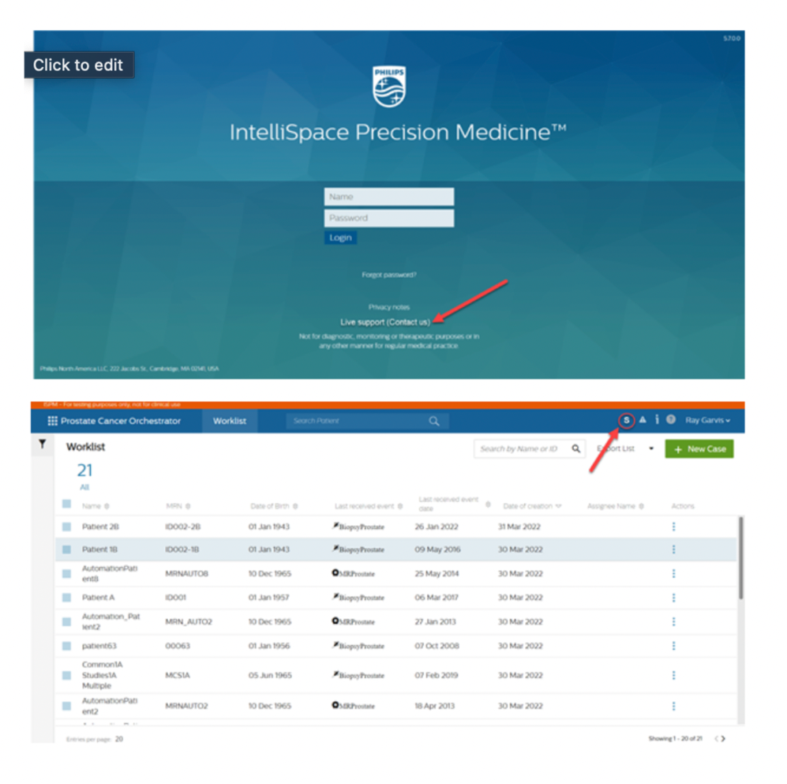

## My role

As the UX Designer, I worked across the initial two-sprint delivery and the later email enhancement.

- Conducted and documented research.
- Designed interactions, wireframes, flows, and prototypes.
- Reviewed the experience for heuristic and design-language alignment.
- Supported usability testing and implementation with the wider team.
- Supplied design assets and rationale for engineering delivery.

## Users and context

The experience served clinical specialists and hospital administrators working across a SaaS platform of connected applications. A support route needed to work both before sign-in and inside the authenticated product because an access issue could prevent users from reaching in-product help.

The solution also had two audiences: clinical-platform users seeking help and administrators maintaining the correct regional email addresses, phone numbers, and external ticketing channels.

## Constraints

- Deliver the initial experience in two sprints, or four weeks.
- Use established platform and design-language foundations rather than introduce a separate support product.
- Accommodate support channels that differed by market, region, and product.
- Make contact content configurable through the administrator experience.
- Adjust interaction details when technical feasibility or the delivery timeline changed.

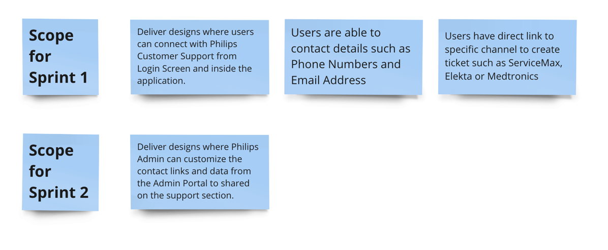

## Discovery

I aligned the scope with stakeholders, reviewed the existing product experience, and examined how comparable software made help discoverable. The work combined customer correspondence, a heuristic review, design-language assessment, and secondary research into support placement and channel selection.

The review showed that users could face several possible contact routes, including region-specific phone support and separate ticketing channels. Without product-aware guidance inside the application, they could reach the wrong team or begin a support request without the context needed to resolve it.

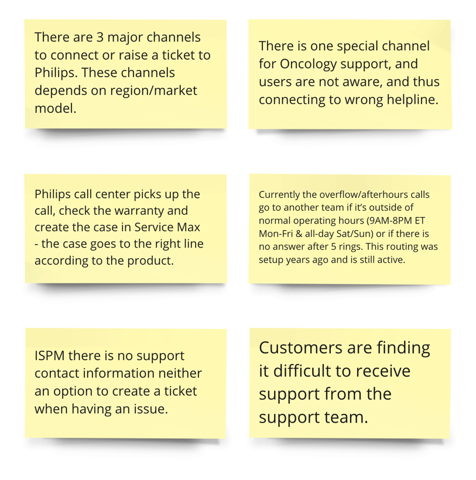

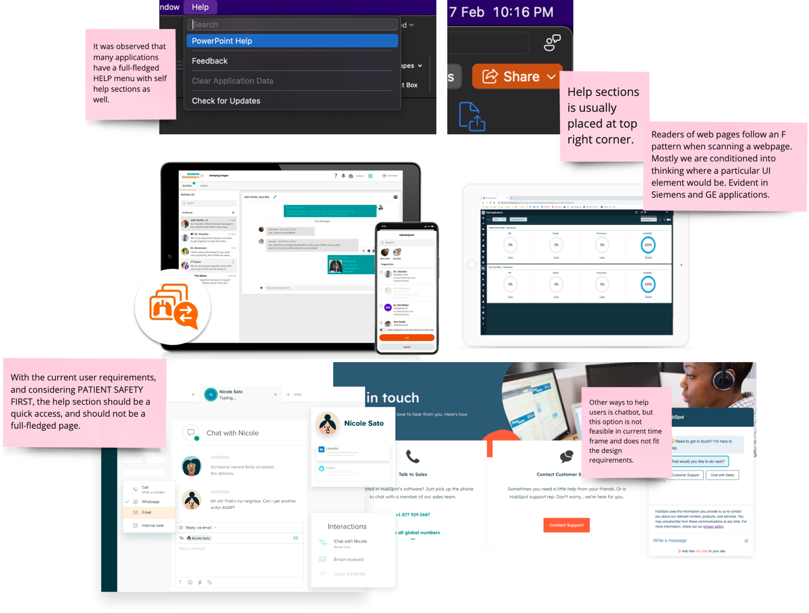

## Key findings

- The platform did not expose support contact information or a clear way to begin creating a ticket.
- Available phone, email, and ticketing routes varied by region and product.
- Users could reach a general support line that lacked the necessary product context.
- Help needed to remain easy to find at the point of failure rather than become a full-screen interruption.
- A support handoff needed to carry structured product and system context, particularly when initiated through email.

## Workflow or information architecture

The information architecture separated self-help content from direct contact and ticketing routes. A persistent Help & Support entry point opened a focused panel, allowing users to review contact information, select the relevant region, or continue to a configured external support channel.

For the first release, the workflow was deliberately narrower than the long-term concept. It prioritised direct access to the right email address, regional phone number, and available ticketing channel.

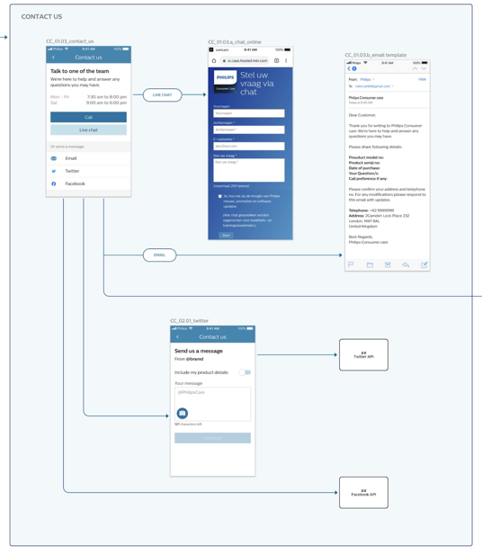

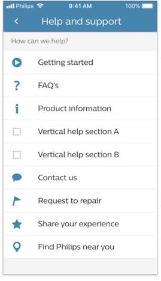

## Design principles

- **Keep support in context.** Make help available from login and inside the platform.
- **Route instead of overwhelm.** Show only contact and ticketing options configured for the user’s context.
- **Preserve the handoff.** Carry enough product and system information for the receiving team to begin acting.
- **Build on familiar foundations.** Use established placement, interaction, and visual patterns to accelerate comprehension and delivery.

## Iterations and validation

The long-term proposal combined getting-started guidance, frequently asked questions, product information, direct contact, and ticketing routes in one Help & Support menu. The four-week implementation focused first on the smallest useful bridge between the user and the correct support channel.

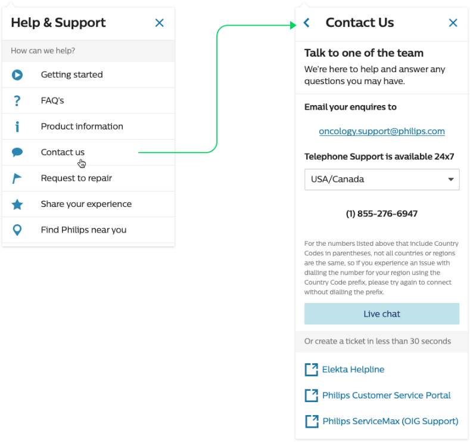

Bridge V1 introduced an email link, a copy action, regional phone selection, and configured external ticketing links. It established the necessary hierarchy but carried more interaction detail than the delivery window could support.

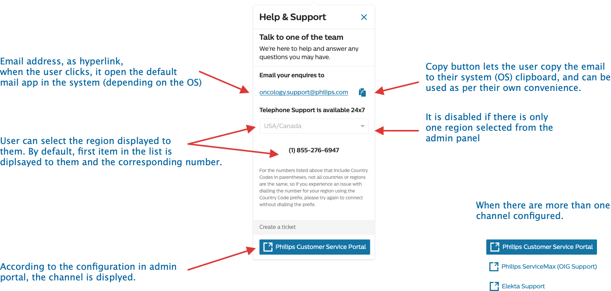

Bridge V2 removed the copy control because of technical and timeline constraints, supported more than one configured email address, and retained the region and ticket-channel logic. This version moved into implementation.

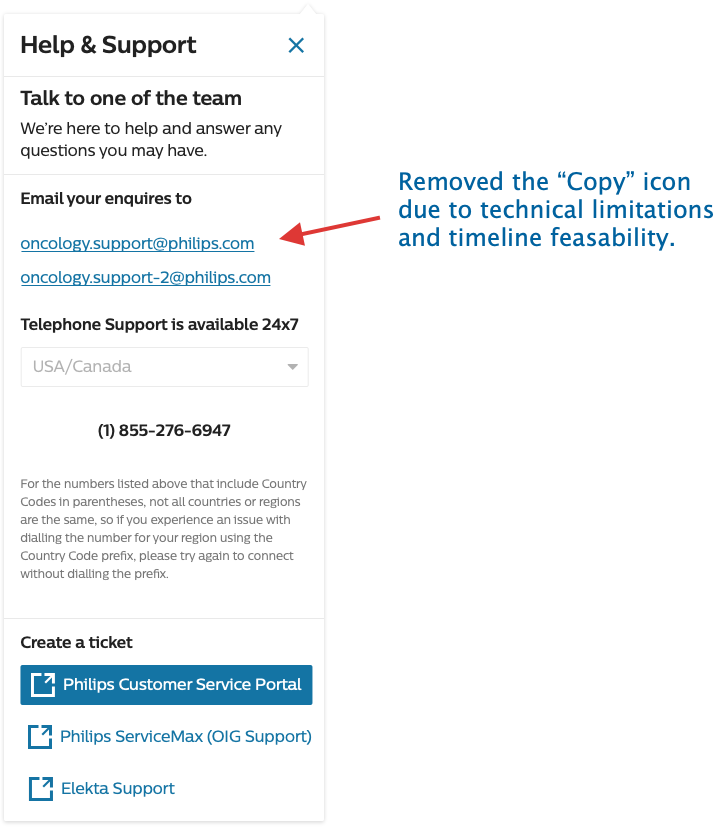

Timed usability testing with seven representative clinical-platform users measured how quickly they could complete the support workflow. Average completion was under one minute.

## Final experience

The implemented support panel was available from both the login experience and the authenticated administrator portal. Users could see the relevant email address, select an available region to reveal the correct phone number, and continue to configured ticketing channels without first searching outside the product.

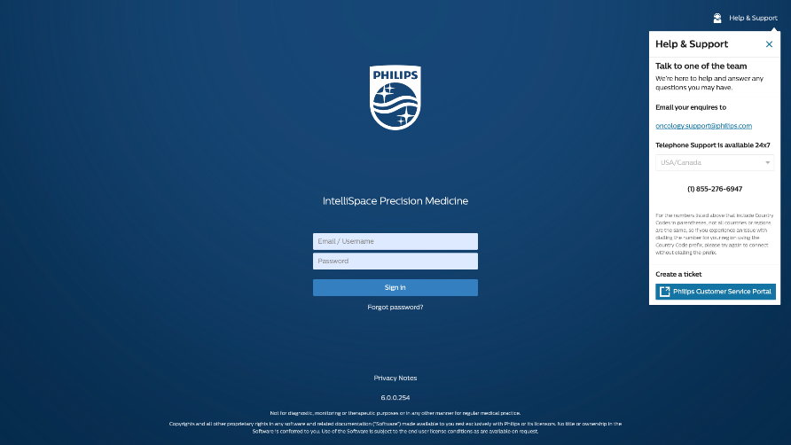

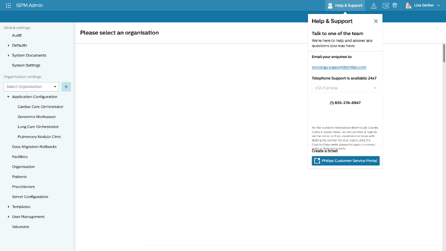

Administrators could enable, add, remove, and edit support email addresses, regional phone numbers, defaults, and external ticketing channels. That configuration controlled which options appeared in the user-facing panel.

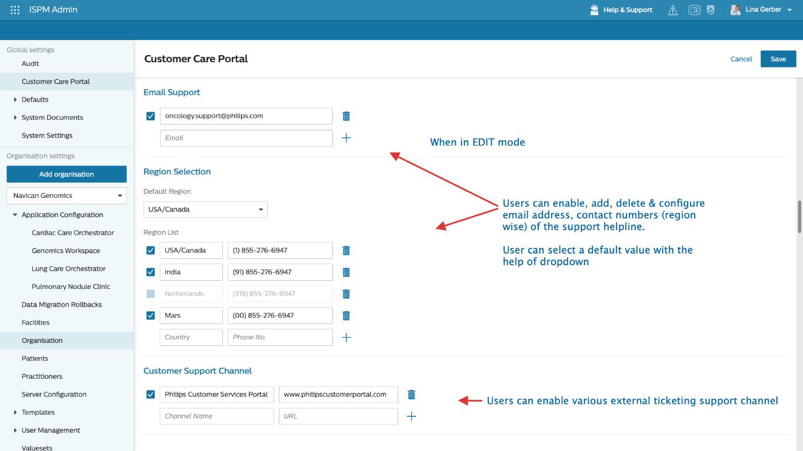

## Design-system alignment

The existing product screens reflected an earlier visual language. I reviewed the experience against the current design guidance and adapted the support interaction to established colour, typography, layout, and graphic-element foundations.

This was an alignment exercise rather than a claim of creating a new design system. Reusing existing patterns reduced design and engineering ambiguity while keeping the support experience consistent with the wider platform.

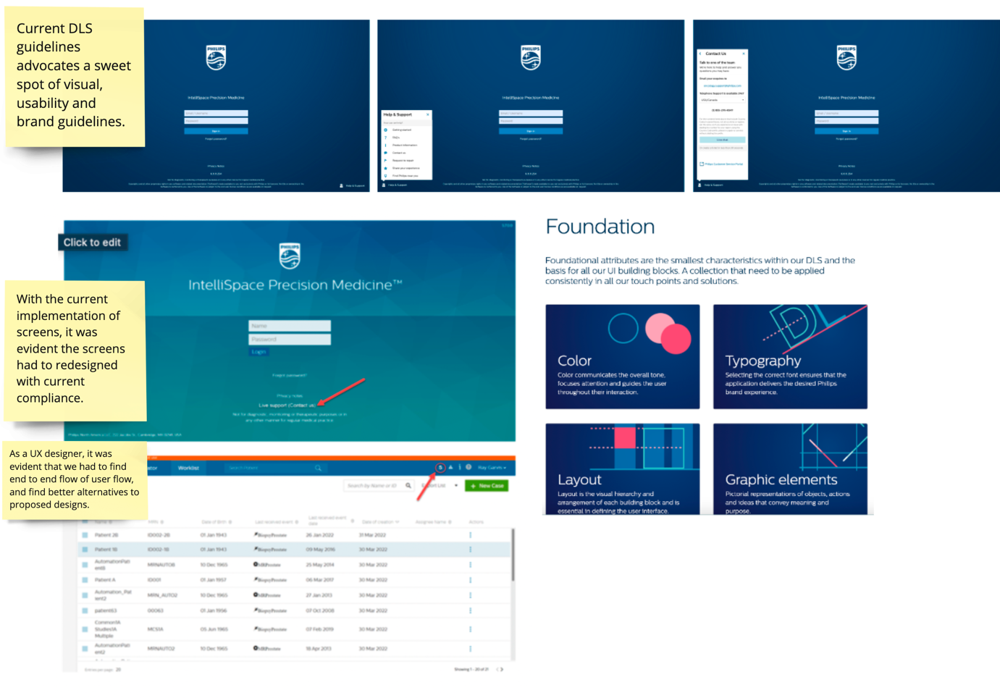

## Follow-up enhancement

Reviewing the end-to-end journey uncovered another gap: selecting an email address opened an unstructured message. Support teams received many emails each day, and inconsistent problem descriptions made requests harder to triage.

The follow-up solution introduced a defined email format with guided questions and automatically supplied system context. This workflow was implemented approximately six months after the initial in-product support release.

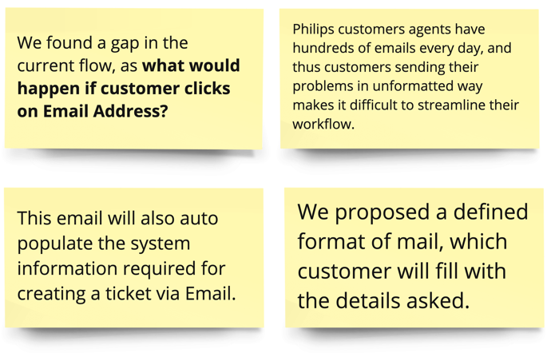

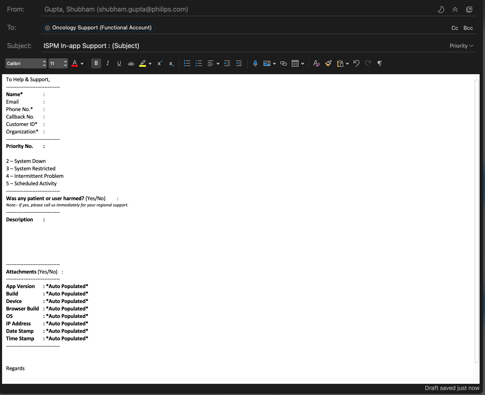

## Outcome

The initial support experience and administrator configuration were implemented within two sprints. In timed usability testing, seven representative users completed the workflow in under one minute on average.

Approximately six months later, the structured email workflow was also implemented, extending the original experience from finding the correct channel to sending a more actionable request.

> Measured result: under one minute average completion across seven representative users during timed usability testing.

## Reflection

The project reinforced that a support entry point is only one part of the experience. Following the journey through contact selection, regional routing, ticket creation, and email handoff revealed issues that were invisible when each screen was reviewed in isolation.

It also showed the value of separating the long-term concept from the smallest useful implementation. The two-sprint bridge resolved the immediate access problem, while the later email enhancement improved the quality of the handoff without blocking the initial release.

## Credits

- Product Owner
- Usability Designer
- Engineering team
