## Overview

FireFlys was developed during the Product Development Project at Aalto University Design Factory in Helsinki. The programme brought together more than 100 students across 20 Design Factories; our nine-person team included members from Finland, Egypt, China, and India.

The project explored a complete early-detection system: a multirotor drone, a modular sensing payload, a stabilising gimbal, a secure connection bracket, and a ground-control interface. The work moved beyond a presentation concept into an integrated prototype that the team assembled, tested, and flew.

## The challenge

Wildfires can spread quickly, so the project focused on detecting a signal while a fire was still at an early stage. The design challenge was not only to carry a sensor into the air, but to keep it oriented during flight, connect it securely to the aircraft, and translate the incoming information into something a ground team could use.

The concept therefore had to address three linked problems:

- carry the sensing equipment on a multirotor platform;
- stabilise and protect the sensor during flight;
- communicate observations through a ground-control workflow.

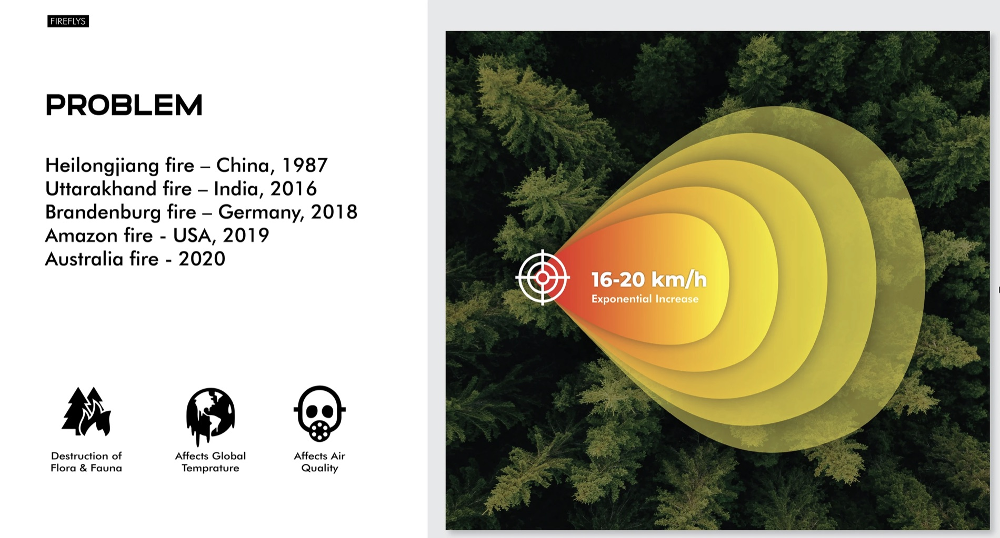

## My role

I worked as a Mechanical Engineer and Industrial Designer. My core responsibility was the heart of the system: the housing for the sensor, its gimbal, and the way the complete payload attached to the drone.

- Designed and developed the sensor payload housing.
- Created 3D models and prepared parts for additive manufacturing.
- Printed, assembled, and tested successive payload and gimbal iterations.
- Designed the mechanical connection between the payload and drone.
- Helped source components, assemble the aircraft, and build a working drone.
- Learned drone fundamentals with guidance from an IIT professor who advised the team on parts and assembly.

## Users and research input

The intended users were firefighting teams responsible for identifying and responding to wildfire risk. The team interviewed five firefighters while developing the concept.

The detailed notes, outcomes, and participant-level findings from those interviews are no longer available. For that reason, this case study records the interviews as a research input but does not reconstruct findings, quotes, or validated requirements from memory.

> Evidence boundary: any more detailed firefighter needs, protocols, or workflow conclusions should be added only after the original research material is recovered.

## Requirements and constraints

The available project material documents the following design requirements:

- a high-payload multirotor platform;
- a modular payload carrying a UV sensor and camera;
- a two-axis gimbal to maintain sensor orientation;
- a secure bracket connecting payload, telemetry, and controller hardware;
- live visual feed, planned flight paths, and incident review in the ground-control concept.

The presentation also records performance targets such as an 800-metre sensing distance, 100,000 signals per second, and a 30-kilometre operating radius. These are retained here as **project specifications**, not independently verified field performance.

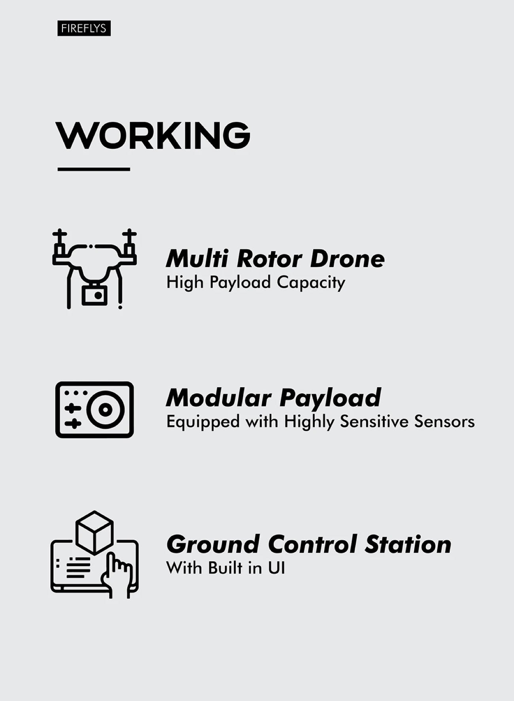

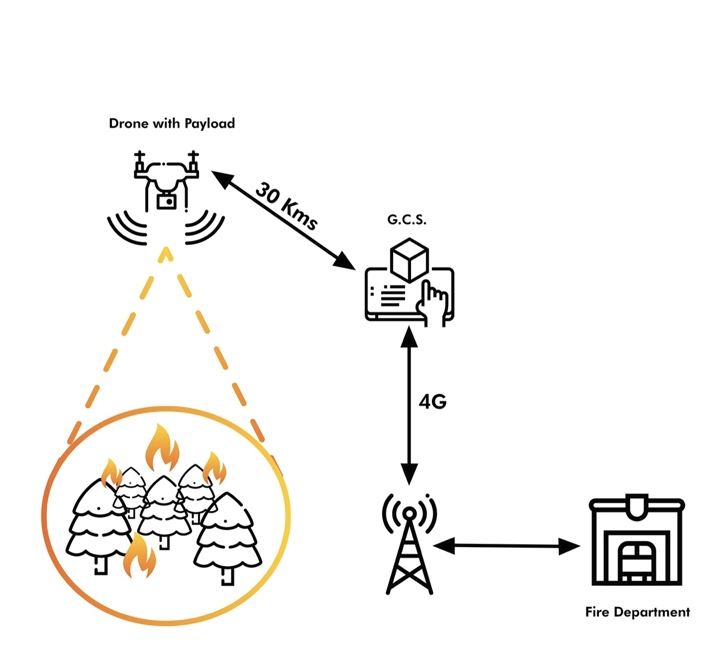

## Concept exploration

Early sketches explored aircraft forms, camera placement, payload proportions, mounting points, and gimbal mechanisms. The sketchbook shows the mechanical questions being worked through together: component dimensions, servo positions, connection geometry, and the relationship between the payload and landing gear.

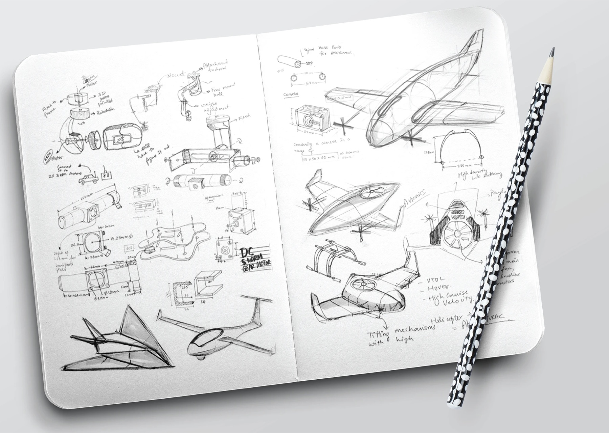

## System architecture

The final concept combined three coordinated layers. The drone supplied the flight platform. The payload packaged the sensing equipment and stayed pointed towards the scan area through a gimbal. The ground-control interface supported launch planning, flight-path definition, live observation, history, and a fire-alert state.

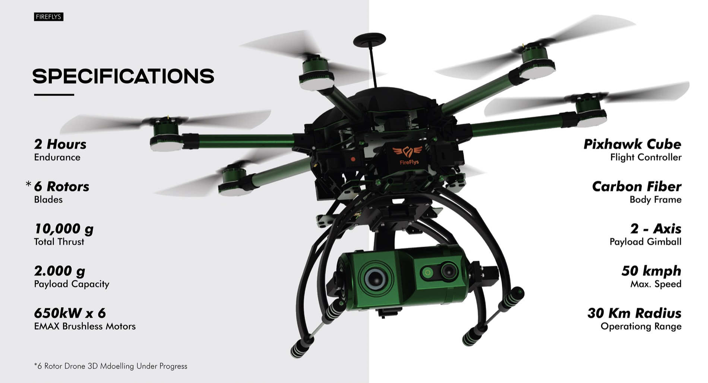

## Payload design — the heart of the solution

The payload had to package the sensor, camera, supporting electronics, motors, and mechanical interfaces in one compact assembly. I developed the housing around those components and designed the interfaces that connected it to the gimbal and aircraft.

The presentation identifies the principal elements as the UV sensor, housing, servo motors, and connection bracket. The exploded view records how the electronics, internal plates, fasteners, gimbal arms, and outer shell related to one another.

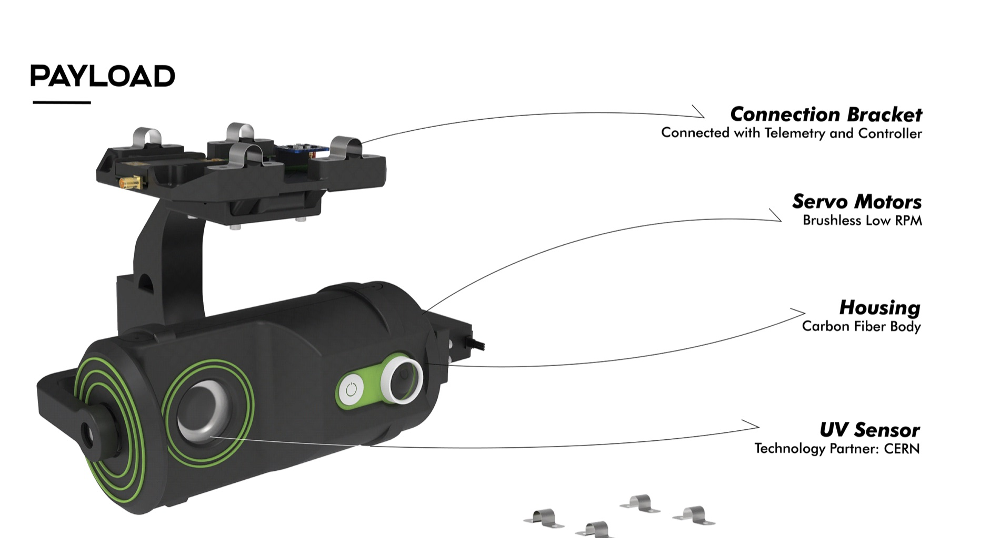

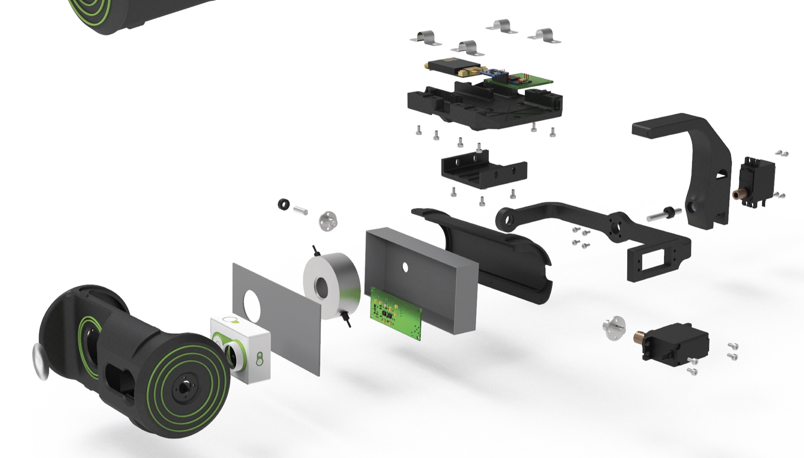

## Gimbal and drone attachment

The two-axis gimbal was designed to keep the sensing payload directed towards the scan area as the drone moved. The connection bracket provided the mechanical bridge to the aircraft while carrying telemetry and controller components.

The landing-gear assembly brought these elements together: landing gear, bracket, gimbal, and the in-house-developed payload. This made the payload a designed subsystem rather than a loose collection of electronics attached beneath the drone.

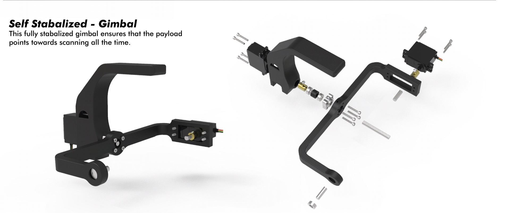

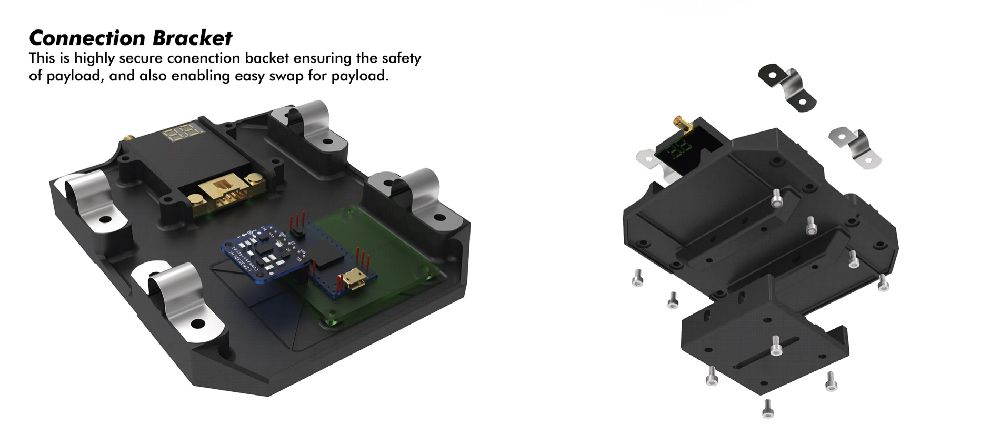

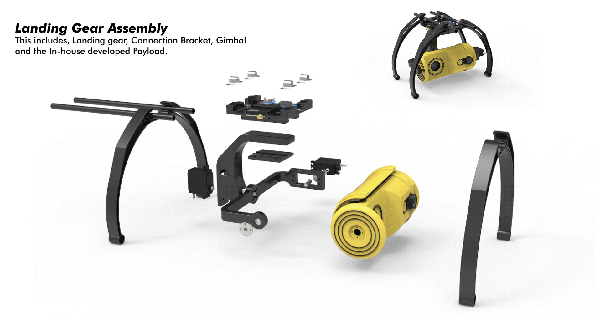

## Sensor integration

The project used a UV sensor associated with CERN as the technology partner in the original material. The recorded specification describes a gas-sealed CsI photocathode, 185–260 nm wavelength range, single-photon detection capability, and a response rate of 100,000 signals per second.

These values describe the selected technology and project specification. The supplied evidence does not include a field-validation report, so the case study does not claim that the complete drone system achieved those values in wildfire conditions.

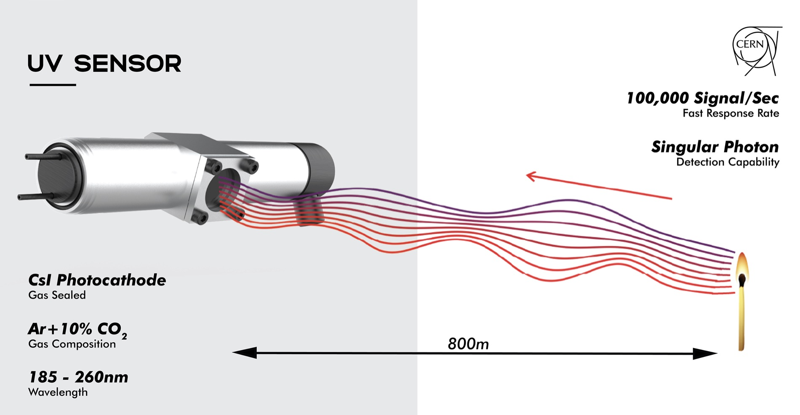

## Iterative prototyping

The payload moved through four major design iterations. The sequence shows a progression from rectangular housings to a rounded enclosure that integrated the sensor, camera, controls, and attachment features into a more resolved industrial-design language.

I used 3D modelling and additive manufacturing to test fit, assembly, component clearance, servo movement, and the relationship between the housing and the drone. Physical prototypes exposed wiring, fastening, balance, and integration issues that were difficult to resolve in CAD alone.

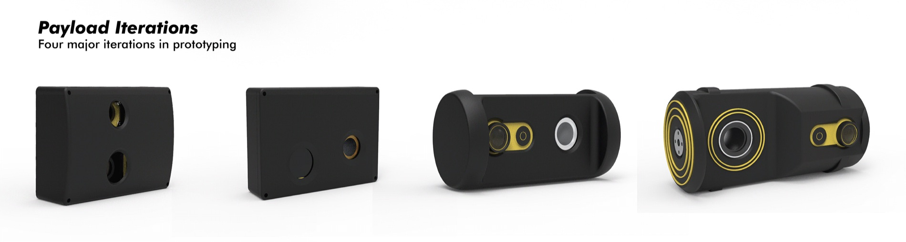

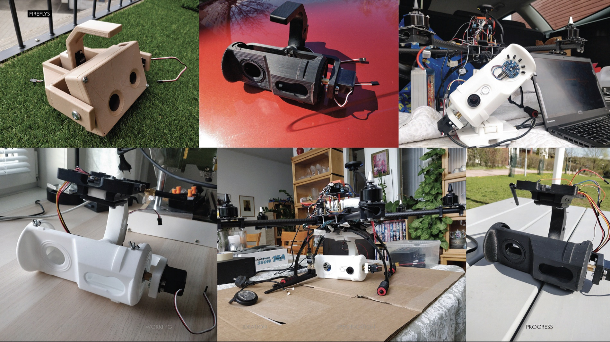

## Physical and digital interaction

The ground-control concept connected the physical scan to a digital operating workflow. The interface material shows an immediate-launch path, pre-planned scan areas, live video, detection history, system status, and an alert overlay.

The supplied visuals demonstrate the intended interface and information model. They do not establish that the full software workflow was deployed with a fire department, so it is presented as a project interface concept.

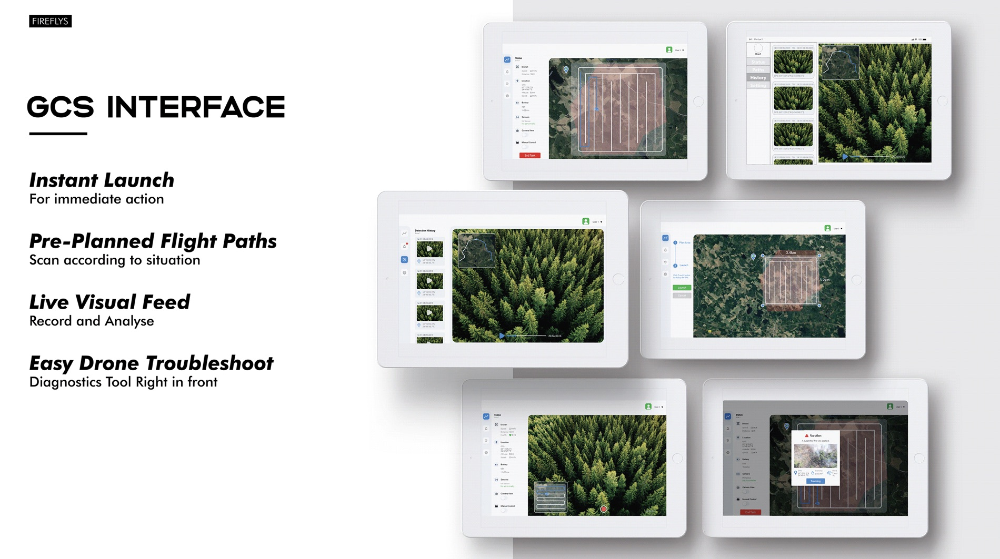

## Integration and testing

The team assembled and tested a real multirotor aircraft rather than stopping at CAD renders. I contributed to the drone build, component selection, mechanical assembly, payload mounting, and iterative tests. An IIT professor guided the team in understanding drone fundamentals, identifying parts, and assembling the aircraft.

The available photographs show the prototype on the ground, workshop integration, team assembly, and outdoor flight preparation. They confirm a working flying prototype, but they do not provide a formal test protocol or measured wildfire-detection results.

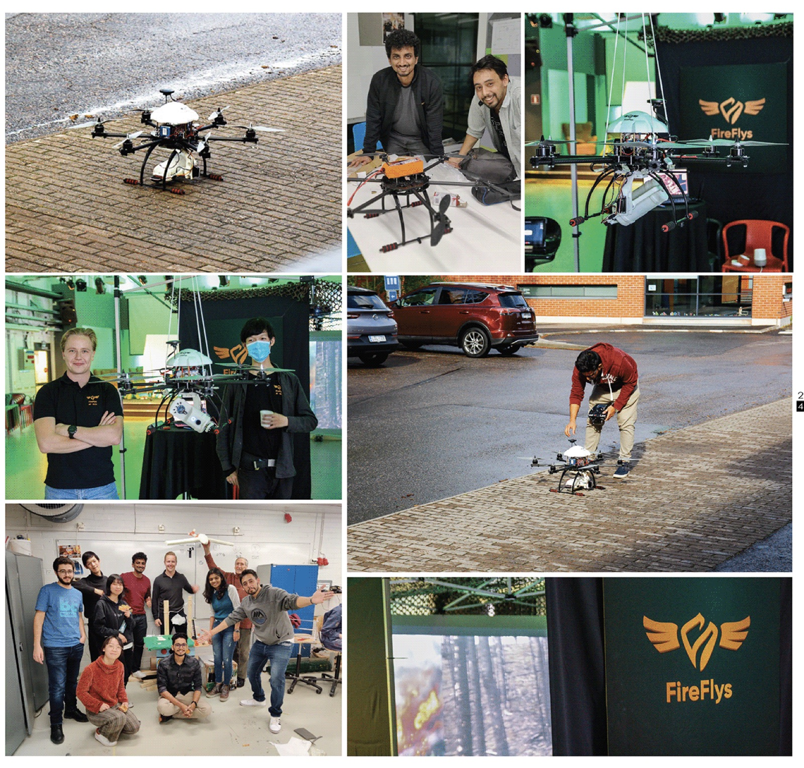

## Final prototype

The final prototype combined the multirotor drone, landing gear, connection bracket, stabilised payload, sensor housing, camera, and supporting electronics. It was presented and flown at the Aalto Design Factory Final Gala on 4 September 2020 in Helsinki.

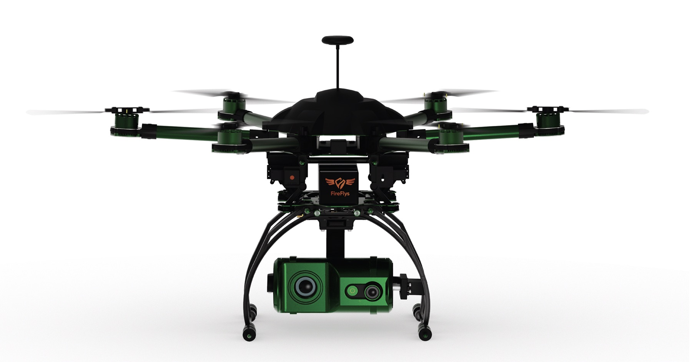

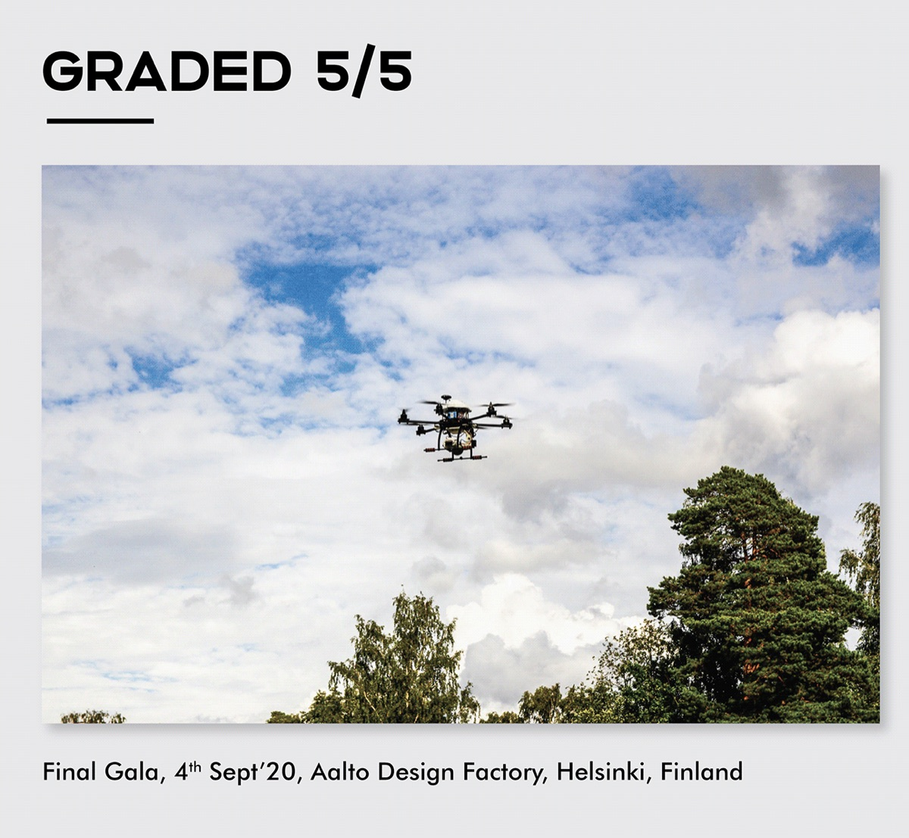

## Outcome

The evidenced project outcome was an integrated flying prototype and a documented industrial-design process with four major payload iterations. The supplied material records a **5/5 grade** at the Final Gala and describes FireFlys as a **top-10 student project showcased by ATTRACT EU**.

The project should not yet be described as operationally deployed, field validated in a wildfire, or proven to reduce response time. Those claims would require evidence that is not present in the supplied resources.

## Reflection

FireFlys taught me to treat a physical product as a connected system. The housing could not be designed independently from sensor behaviour, gimbal movement, aircraft balance, electronics, attachment, manufacturing, and the information that operators would eventually receive.

It also reinforced the value of making early. Moving between CAD, printed parts, assembly, and flight preparation turned abstract mechanical decisions into visible constraints and gave the team a practical way to improve the design.

## Credits

FireFlys was created by a nine-person interdisciplinary student team through the Product Development Project at Aalto University Design Factory, Helsinki, with participants from ISDI Mumbai and Aalto University. The original project material cites ATTRACT EU funding, CERN as technology partner, and guidance from an IIT professor. Individual names and the professor's institution are not included because they were not supplied for this case study.
