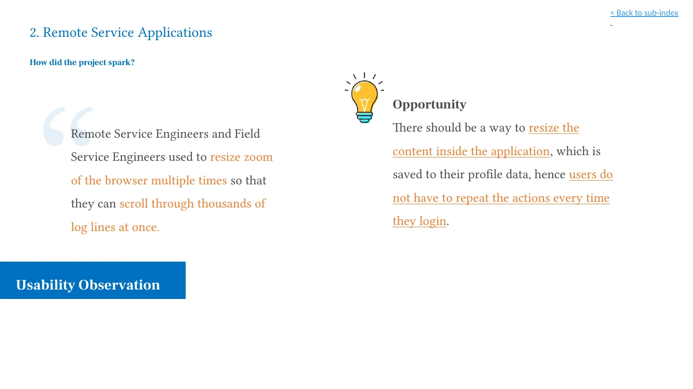
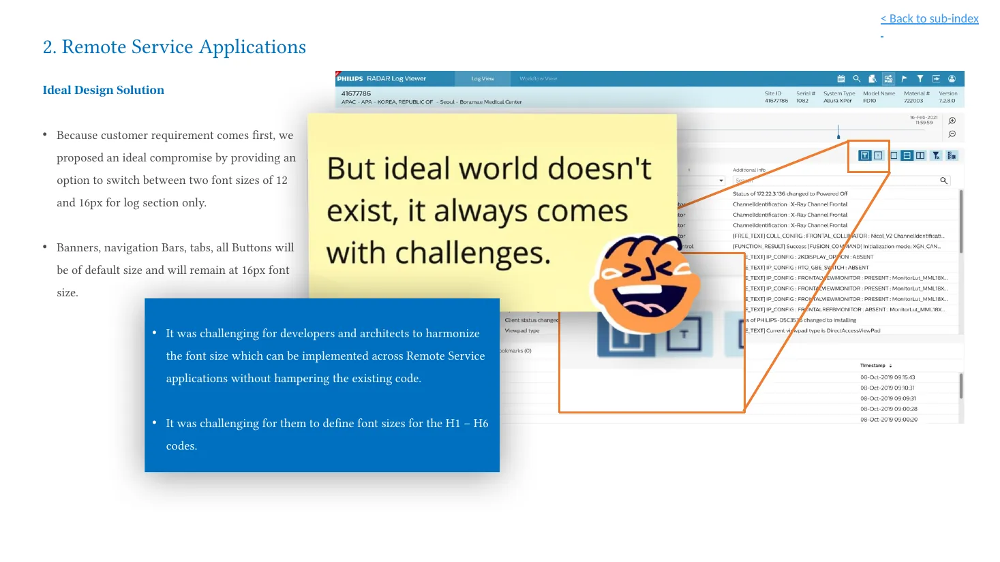
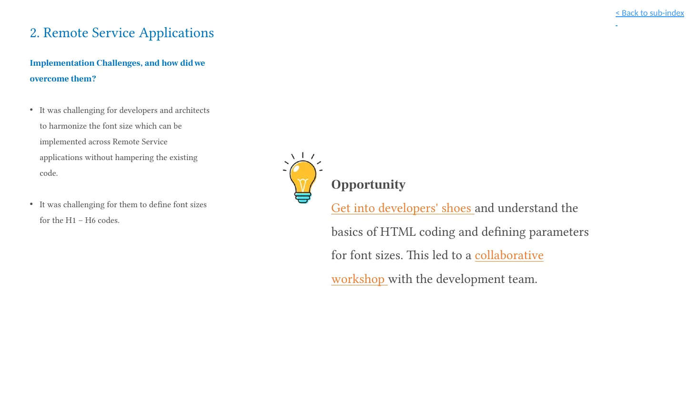

## Overview

This project began with an observed workaround: remote and field service engineers repeatedly changed browser zoom so they could scan more log lines at once. That workaround helped people fit more information on screen, but it applied to the whole page rather than to the high-density content that needed it.

I facilitated a focused workshop with developers to turn that observation into a practical, reusable font framework. The result was a two-size reading mode for log sections, paired with clear implementation boundaries for the rest of the interface.

## The challenge

Dense logs require different reading conditions from navigation, banners, tabs, and buttons. The challenge was to give engineers more compact log content without shrinking shared controls or creating inconsistent typography across related applications.

## My role

As UX Designer & Workshop Facilitator, I:

- Identified and framed the browser-zoom behaviour as a readability opportunity.
- Defined the design boundary: only log sections could change size.
- Facilitated a two-hour working session with developers to make the hierarchy implementable.
- Created the reference framework that supported the shipped change.

## Users and context

The work served remote and field service engineers reviewing large volumes of technical log information in remote-monitoring applications. The relevant task was scanning and interpreting log content efficiently—not changing the appearance of the entire application.

## Constraints and guardrails

- The supplied deck documents a 16dp baseline for normal web copy and a 12dp lower bound intended for limited, non-prolonged use.
- The shipped reading mode was limited to log sections: 16px default and 12px small.
- Banners, navigation bars, tabs, and buttons remained at their default size.
- Developers and architects needed a hierarchy they could apply without disrupting existing code across related applications.

## Discovery

The starting point was an observed behaviour rather than a request for a large redesign. Engineers were already adapting the interface with browser zoom. The opportunity was to move that adaptation into the product and make it purposeful.

## Design response

The proposal preserved standard-size interface controls and introduced an explicit choice only where density mattered: the log reader. This made the trade-off visible, constrained, and straightforward to explain.

## The developer workshop

The workshop objective was to determine base fonts, weights, and their multiples for default and small font-size modes. Rather than creating a complex new solution, the session focused on making the typography math explicit enough for developers to implement consistently.

### Workshop grid

The following values are transcribed from the supplied workshop grid. The original `Factor` column is retained as documented; it is not recalculated or interpreted here.

| Tag | Default | Factor | Small |
| --- | --- | --- | --- |
| Base (a, label, table content etc) | 16px | 1 | 12px |
| H1 | 20px Bold | 1.25 | 16px Bold |
| H2 | 20px Bold | 1.25 | 16px Bold |
| H3 | 20px Normal | 1.25 | 16px Normal |
| H4 | 18px Bold | 1.125 | 14px Bold |
| H5 | 18px Medium | 1.125 | 14px Medium |
| H6 | 16px Bold | 1 | 12px Bold |
| Table headers | 14px Normal | 0.875 | 12px Normal |
| Tooltips/Error | 12px Normal | 0.75 | 12px Normal |
| Tooltips | 12px Bold | 0.75 | 12px Normal |
| Table row height | 32px | 2 | 24px |
| Component padding (top/bottom) | 12px | — | 8px |
| Space between content | 12px | — | 12px |

## Shipped implementation

The 12px and 16px log-reading option, supported by the framework above, was deployed to users after two sprints. This case study does not claim profile persistence, adoption figures, or measured performance effects because those were not supplied as evidence.

## Outcome

The project delivered two connected outputs:

- A shipped, scoped font-size option for dense log sections.
- A developer-facing typography guide that made the hierarchy and fixed-element rules explicit.

> The practical outcome was a focused reading control and a clearer implementation conversation—not a full-interface rescaling exercise.

## Reflection

This work reinforced that some technical problems are best advanced through design leadership rather than a larger feature set. Whiteboarding with developers, making space for informal shared moments (including some chocolates), and building trusted stakeholder relationships helped the group move from a usability observation to a workable framework. Strong relationships made it easier to surface constraints early and solve the right-sized problem together.

## Credits

Case-study source: user-supplied 2022 project deck. Screens shown in this case study retain legacy visual branding from that source and are intended to be replaced when updated assets are available.
