## Overview

Humanising the LT-20 Classic was a nine-month industrial-design collaboration with Ace Designers in Bengaluru. The project ran from January to September 2017 and focused on an established CNC turning centre whose technical capability was stronger than the experience communicated by its enclosure, operator touchpoints, and visual identity.

The brief began as a request to improve the machine's outlook and first impression for a global market. Fieldwork expanded that brief. The opportunity was not simply to style a new outer shell, but to connect appearance with operator posture, guarding, maintenance access, chip and coolant handling, manufacturing feasibility, and a recognisable product-family language.

> **Project status:** selected industrial-design concept, native CAD, renders, engineering drawings, and a physical appearance model. The archive does not establish a production release, functional prototype, or measured post-launch outcome.

## Product opportunity

The existing LT-20 Classic was documented as a collection of visually separate enclosures, largely finished in black and white. The research also recorded practical concerns around chip collection, coolant filtration, chips becoming trapped near the door, the projecting stainless-steel guard, and the physical effort required to use and service the machine.

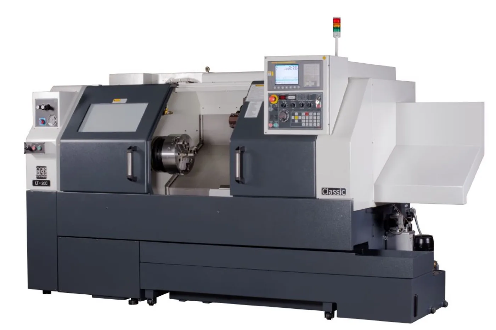

The central tension was clear: respondents rated the machine's functionality highly, while ease of use and appearance were weaker. The redesign therefore needed to preserve technical credibility while making the surrounding experience more coherent and considerate of the people who operated, maintained, cleaned, sold, and transported it.

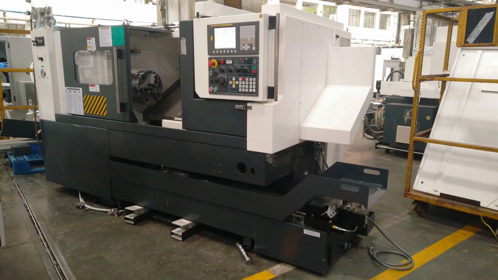

## My role

I worked in a two-person design team with Aditya Sharma. I co-led the user research and ergonomic study, then owned the concept sketching, 3D modelling, and rendering used to develop and communicate the machine concepts.

- User research and shop-floor observation
- Ergonomic analysis
- Concept sketching
- 3D modelling
- Rendering and visualisation
- Collaborative concept selection

Aditya co-led the research and ergonomic work. He owned the presentation, branding exploration, stakeholder management, and future-facing brand narrative. Major design decisions were shared.

## Users, environment, and constraints

The project considered a broader industrial system than the operator alone:

- operators working at the control panel and loading area;
- manufacturing teams responsible for components, sheet metal, paint, and assembly;
- service engineers requiring access behind the outer guarding;
- cleaning staff managing coolant, chips, dust, and residue;
- sales teams communicating functional and visual value;
- transport and packaging teams affected by size and footprint.

The working environment included rotating machinery, coolant and metal chips, guarded access, repeated maintenance, and uneven lighting. The available machine documentation also required doors and covers to remain unobstructed, guarding to stay closed while the spindle rotated, and sufficient clearance for maintenance and chip-conveyor access.

These realities became connected design constraints:

- retain the machine's core architecture and guarding function;
- reduce the impression of disconnected boxes;
- improve visibility and physical access around the controller;
- preserve safe door closure and service clearance;
- support chip and coolant collection and cleaning;
- work with Ace's existing sheet-metal, painting, and assembly capabilities;
- avoid unnecessary imported parts or new technical development;
- consider packaging footprint, material use, weight, and tool storage;
- create visual elements that could inform a wider machine family.

The constraints guided concept development. They were not all formally tested after design.

## Field research

The project combined several evidence sources:

- review of the LT-20 Classic specification and instruction manual;
- stakeholder interviews at Ace Designers;
- silent observation of operators on the shop floor;
- observation at Ace's J33 plant;
- competitor and trend research at IMTEX 2017;
- an exploratory 14-response operator survey;
- comparison of local and international CNC-machine brands.

The archive records a one-week interview phase followed by shop-floor observation, but it does not preserve the interview participant count, recruitment method, interview guide, or a formal coding process. Those details are therefore left unclaimed.

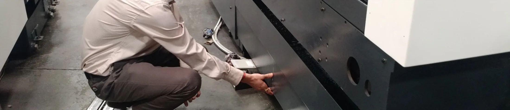

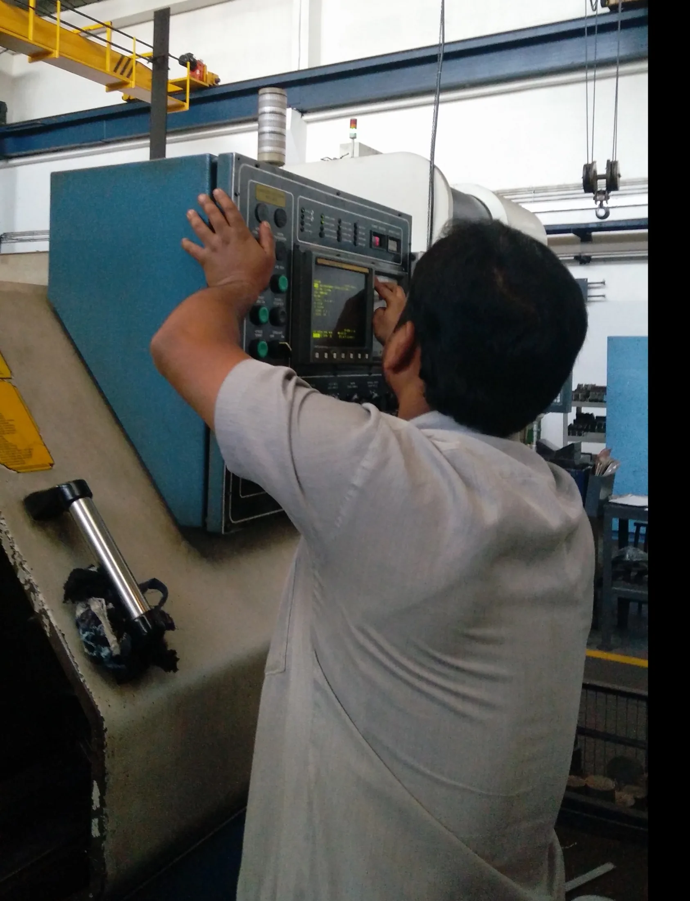

The survey supplied a directional baseline. All 14 respondents rated functionality either 4 or 5 out of 5. Average ease of use was 3.57, while average appearance was 2.43. Twelve respondents selected at least one area of physical strain.

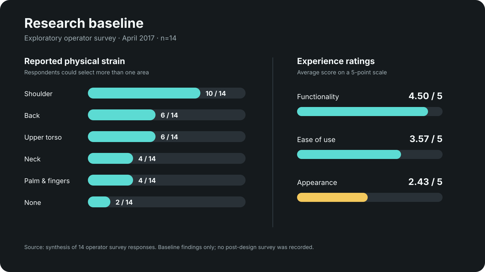

Chip and coolant handling also formed part of the observed operating context.

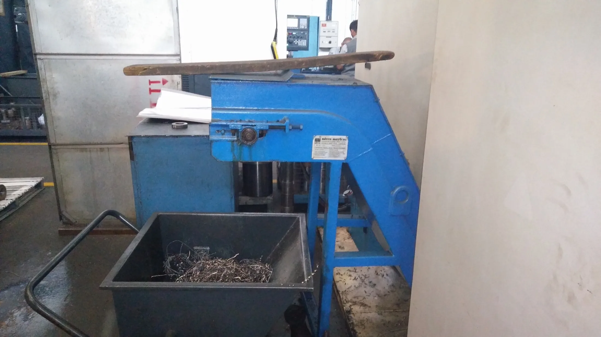

## Process overview

The overall January-September 2017 timeline is confirmed by the project owner. The surviving schedule documents a more detailed, overlapping core phase:

| Workstream | Recorded dates | Primary output |
| --- | --- | --- |
| Research | 8-22 February | Product, stakeholder, operator, and competitor evidence |
| Problem solving | 15 February-8 March | Opportunity areas and design constraints |
| Concept generation | 25 February-16 March | Alternative enclosure and interaction directions |
| Graphics | 16-24 March | Visual language and presentation development |
| Rendering | 25 March-1 April | Comparative and resolved concept views |
| 3D modelling | 2-9 April | Component-level CAD and engineering resolution |

These workstreams overlapped rather than forming a simple linear sequence. Physical-model photographs dated 25 April show that model-making continued after the final dated CAD phase, while the wider collaboration continued through September.

## Human factors and ergonomics

The 14-response, multi-select survey recorded:

- shoulder strain: 10 respondents;
- back strain: 6 respondents;
- upper-torso strain: 6 respondents;
- neck strain: 4 respondents;
- palm-and-finger strain: 4 respondents;
- no strain selected: 2 respondents.

The accompanying ergonomic notes documented operators holding an arm at the console, supporting the hand against its upper edge, and entering commands for approximately three to four continuous minutes. Reaching, pushing, pulling, turning, bending, and lifting were also observed around the machine.

These findings informed several design responses: clearer integration around the controller, a local task light for low-lit conditions, magnetic door closures, a magnetic stopper for storage access, and better accommodation of the operator around the enclosure.

The evidence shows that the ergonomic findings informed the concept. It does not include a post-design assessment proving that the proposal reduced strain.

## Concept exploration and selection

I moved from broad form exploration to annotated sketches that connected façade decisions with the controller, vents, doors, chip tray, coolant filtration, and maintenance access.

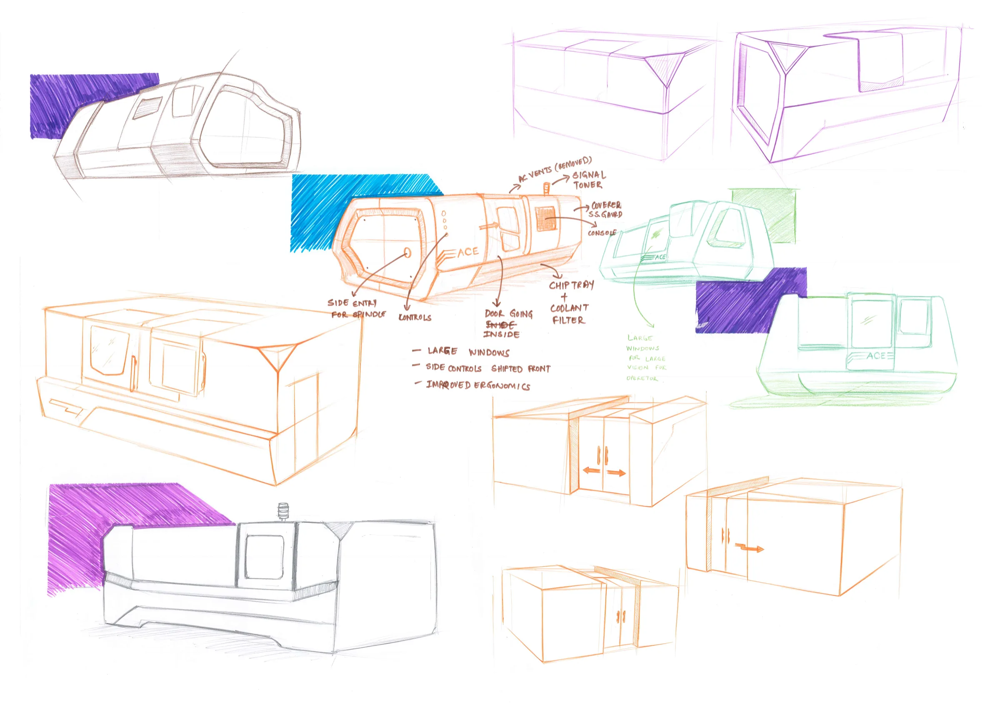

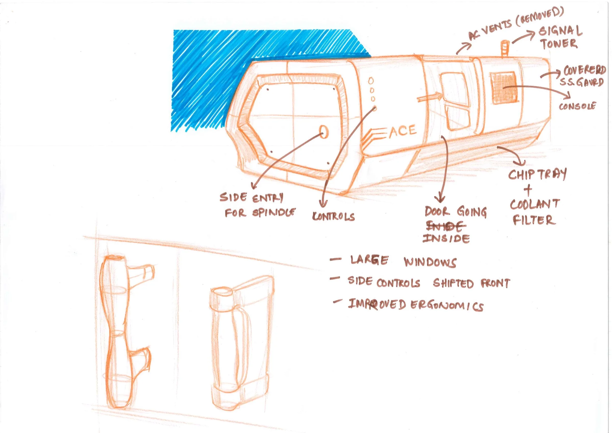

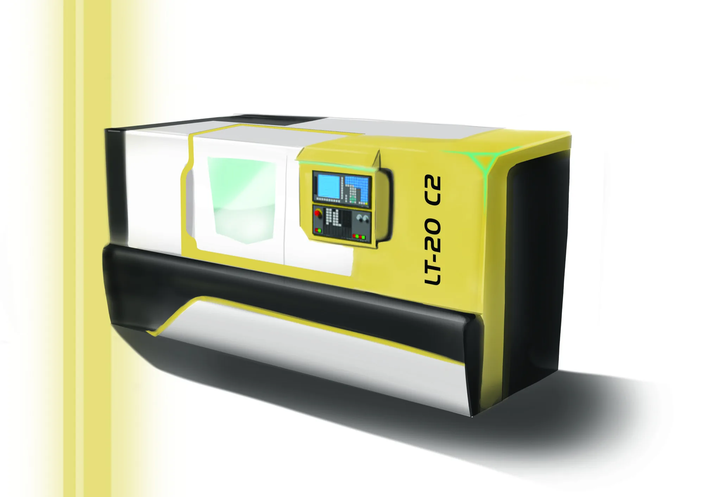

The surviving thesis and presentation use inconsistent concept numbers, so the directions are described here by their defining decisions:

1. **Integrated-cover studies** raised the roof corners, visually absorbed projecting components, and enclosed gaps across the front elevation.
2. **Roll-band direction** replaced the horizontally swinging stainless-steel guard. It reduced footprint and sheet material, but introduced an imported mechanism and additional maintenance.
3. **Retained-guard direction** kept the existing guard inside a fuller sheet-metal composition. It used more material and increased size and weight, but stayed closer to in-house capability and created space for tool storage.

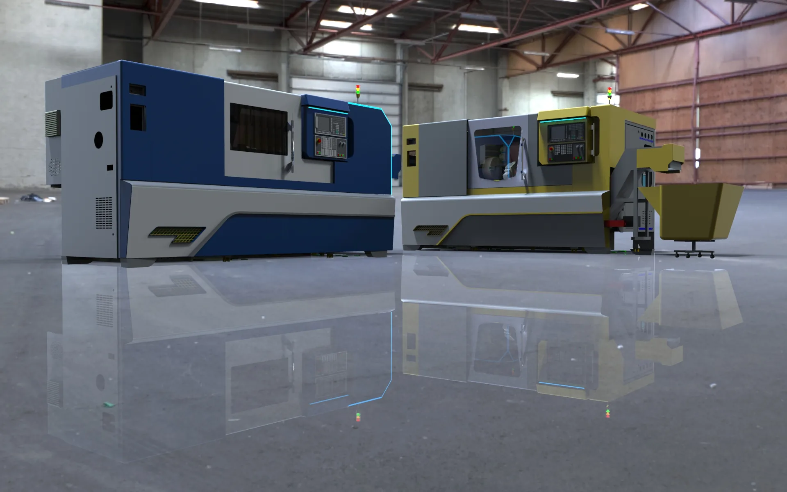

The retained-guard, no-roll-band direction moved forward. The documented rationale combined in-house manufacturability, avoidance of an imported mechanism, compatibility with the existing guard, added storage, and a balance of aesthetics, cost, and implementation feasibility.

The choice was recorded through pros-and-cons comparison and team judgement. No weighted decision matrix, engineering sign-off, manufacturing trial, or formal approval record survives.

## Physical interaction and engineering resolution

The project did not redesign the CNC software interface. It focused on how the physical enclosure supported the existing controller and the work happening around it.

The proposed experience included:

- an integrated surround connecting the controller to the machine;
- an LED task light above the console;
- magnetic closures intended to keep doors from opening unintentionally;
- a magnetic stopper for tool and cleaning-cloth storage;
- lower ventilation openings for motor airflow;
- a dedicated movable bin for chip and coolant collection;
- a revised tower-light treatment for machine-status visibility.

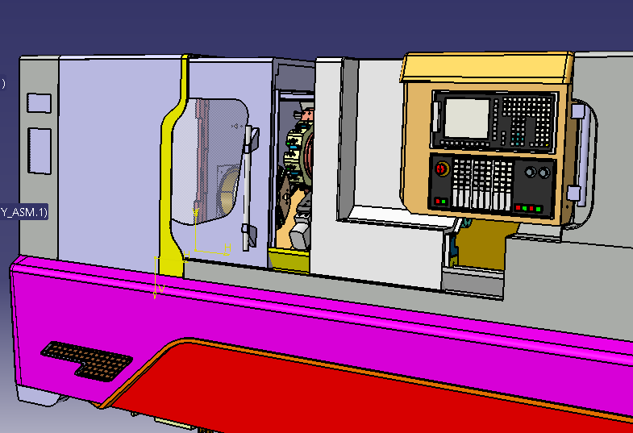

These were design proposals. The archive does not document electrical integration, interlock verification, airflow analysis, or functional testing.

## Prototyping and engineering artefacts

The project progressed from sketches to realistic renders and native component-level CAD. The surviving model contains separate parts for the enclosure, doors, covers, controller surround, conveyor, ventilation, storage, hydraulics, and waste bin.

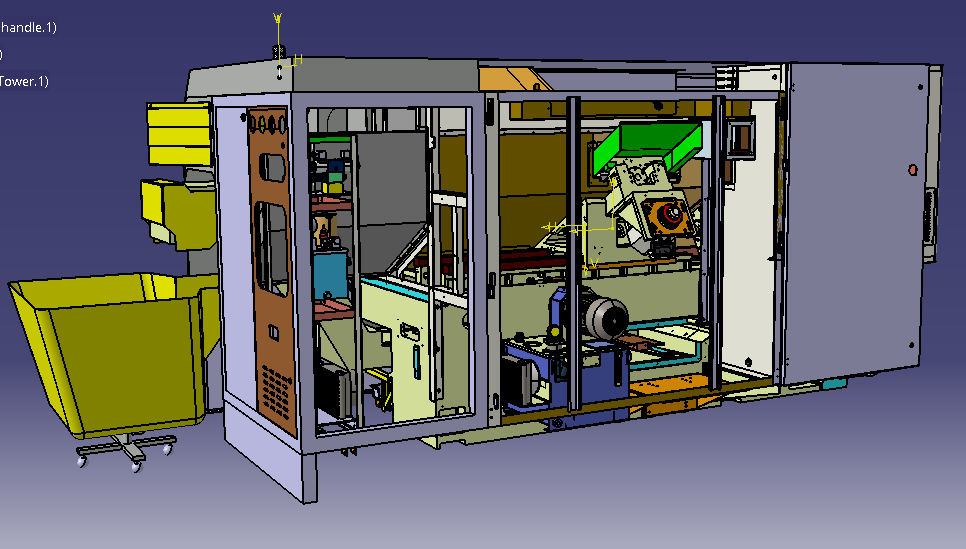

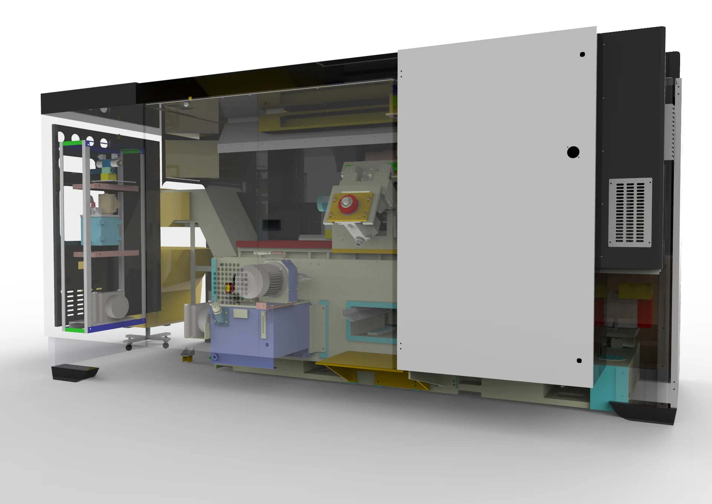

Two supporting drawings translated the conveyor and bin concepts into orthographic views.

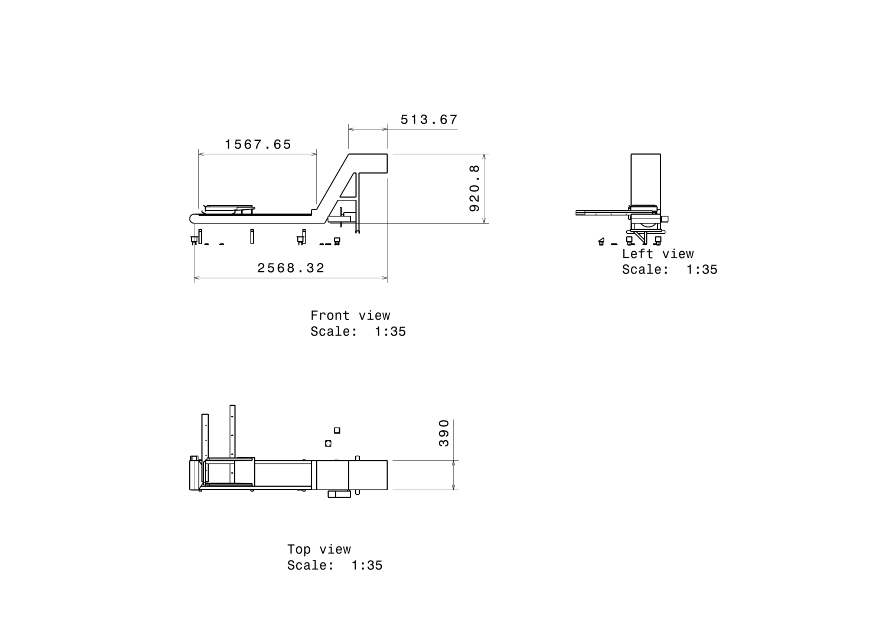

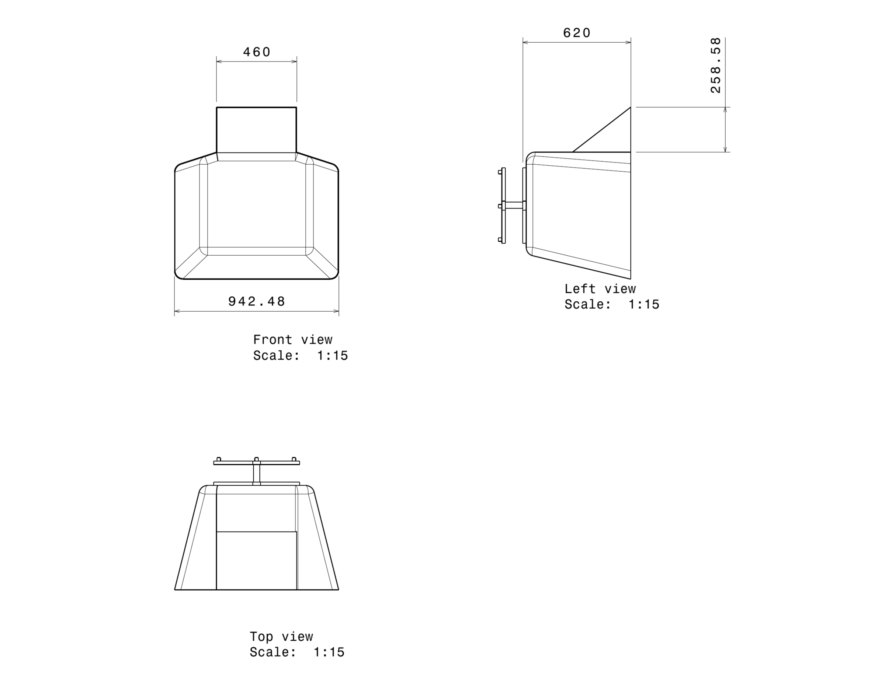

A painted physical appearance model made the selected stance, proportions, colour blocking, controller placement, and separate chip-bin element tangible.

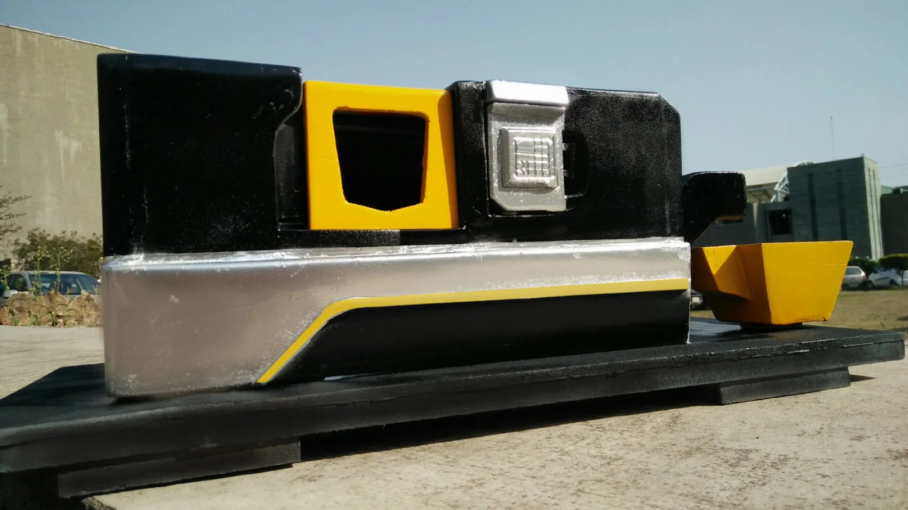

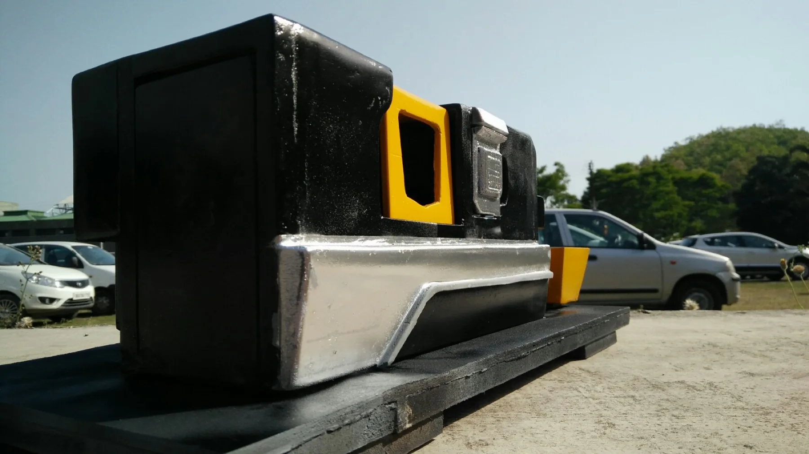

The source material does not state the model's scale, material, fabrication method, dimensional accuracy, or test purpose. It is therefore described as an appearance model, not a functional or engineering prototype.

## Validation boundaries

The research established that the starting problems were relevant to operators and other stakeholders. The survey and observation material provide evidence of the baseline experience, including ergonomic strain and the gap between high functionality ratings and lower appearance ratings.

The supplied archive does not contain:

- a usability test of the selected concept;
- a repeated ergonomic assessment;
- an operational safety or interlock test;
- an airflow or thermal test;
- a manufacturing or assembly trial;
- measured service-time or cleaning improvements;
- production adoption or post-launch customer feedback.

The concept and appearance model are therefore presented as resolved project outputs, not as proof of improved safety, ergonomics, usability, cost, or sales.

## Final product concept

The selected concept brought the main design decisions together:

- retained stainless-steel guarding within a unified outer shell;
- stronger continuity across the front, roof, and control area;
- an integrated controller surround and local task light;
- lower motor ventilation;
- magnetic door closure and storage access;
- dedicated tool storage;
- a redesigned movable chip bin;
- a proposed tower-light treatment;
- a grey, white, yellow, and later blue-led visual language.

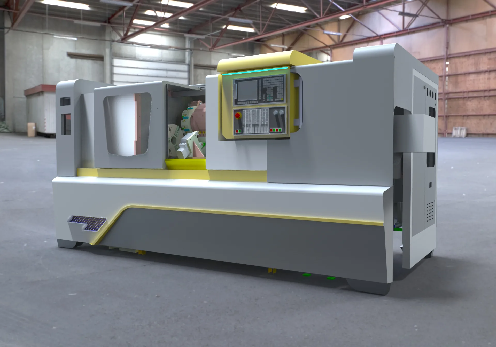

The selected direction aimed to work with Ace's existing component manufacturing, sheet-metal fabrication, painting, and final-assembly capabilities. Retaining the stainless-steel guard avoided the imported roll band, while additional sheet-metal coverage created the unified enclosure.

## Building a coherent machine family

Brand expression remained a supporting strand rather than the main outcome. Aditya led the future brand narrative and presentation work, while major product decisions remained collaborative.

The visual exploration asked how consistent colour blocking, a recognisable front profile, the controller surround, lighting, and repeated enclosure details might connect a wider Ace machine portfolio. The archive demonstrates that proposal, but it does not establish commercial adoption.

## Outcome and reflection

The evidenced outcome was a selected industrial-design direction developed through research, ergonomic analysis, sketches, digital studies, native CAD, renders, engineering drawings, and a physical appearance model.

The most defensible result is the design resolution itself: a coherent proposal that connected operator needs, maintenance access, manufacturing realities, and brand expression without requiring a new core machine architecture.

This project changed how I understood the word *appearance*. On an industrial machine, form is inseparable from posture, guarding, maintenance access, chip handling, ventilation, manufacture, transport, and the confidence a product communicates before it is switched on.

If I extended the project today, I would build a full-scale ergonomic mock-up, define reach and visibility criteria before concept selection, involve operators and service engineers in structured evaluation, and validate safety, airflow, assembly, cleaning, and maintenance before making any outcome claim.

## Credits

- **Shubham Gupta** - co-led research and ergonomics; owned concept sketching, 3D modelling, and rendering.
- **Aditya Sharma** - co-led research and ergonomics; owned presentation, branding, stakeholder management, and the future brand narrative.
- **Shared ownership** - major design decisions and concept selection.
- **Ace Designers, Bengaluru** - industrial partner, machine access, and stakeholder context.
- **Evidence base** - the two final theses, phased presentations, April 2017 survey, machine documentation, CAD archive, renders, drawings, and appearance-model photographs supplied with this project.

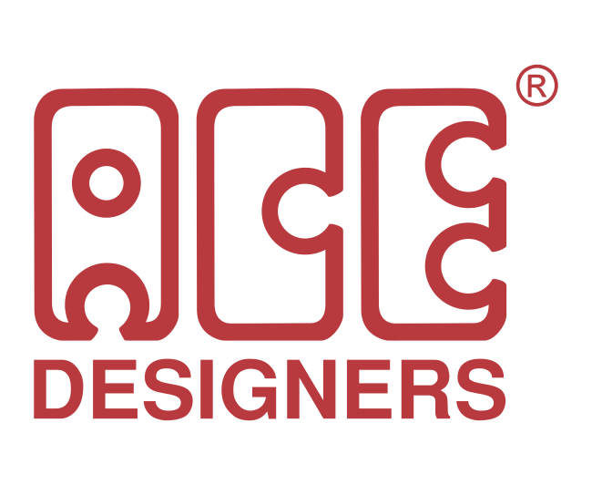
