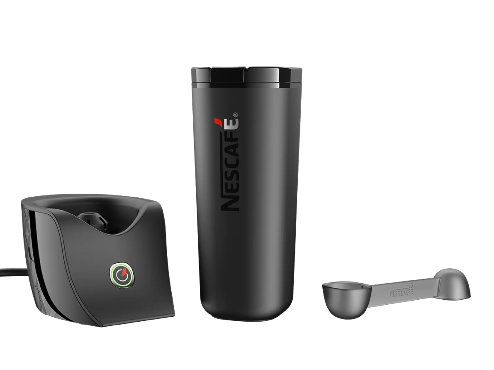
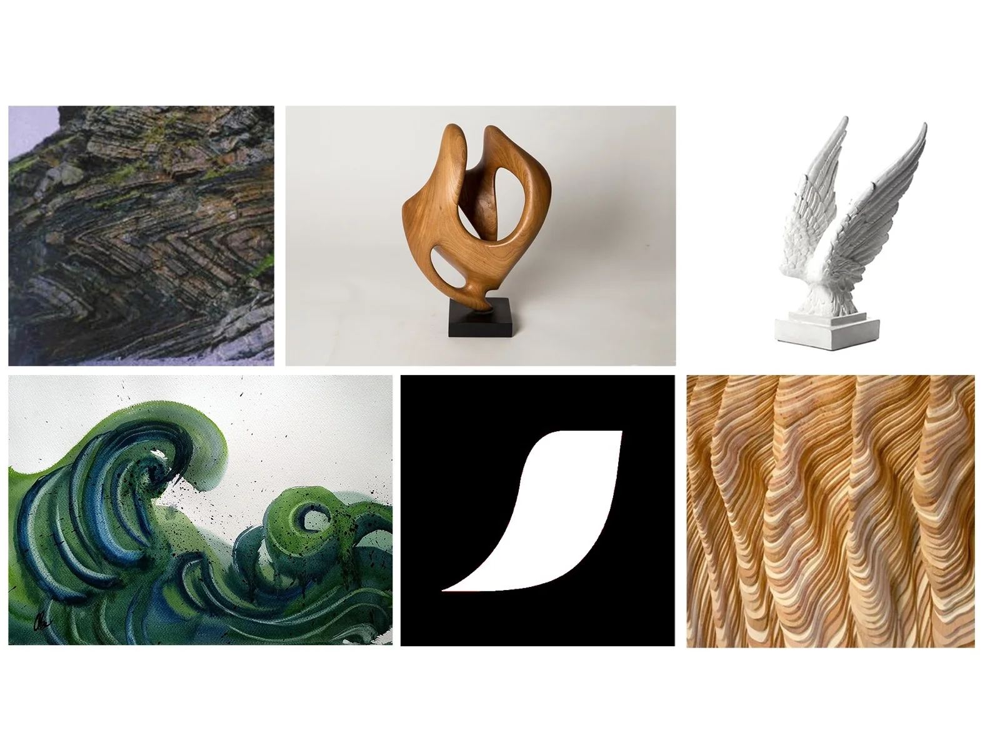
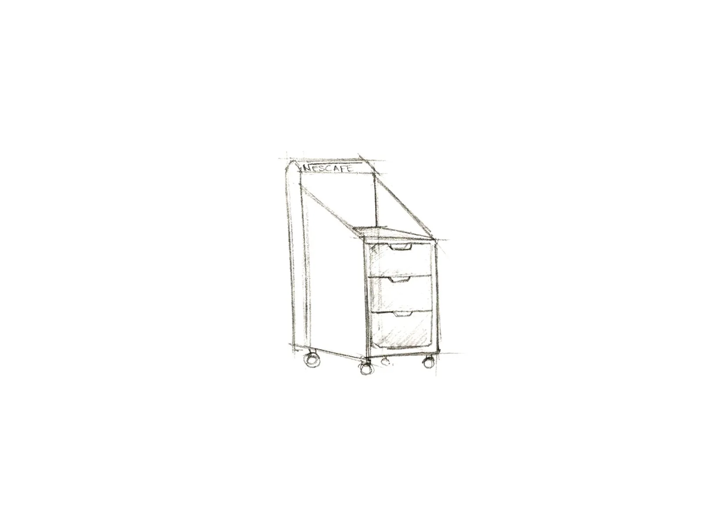
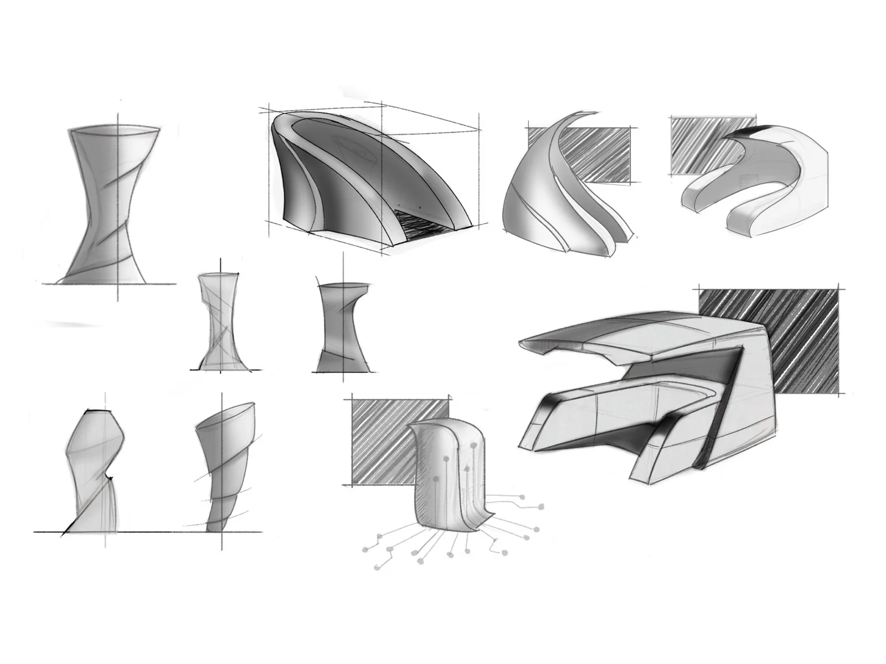
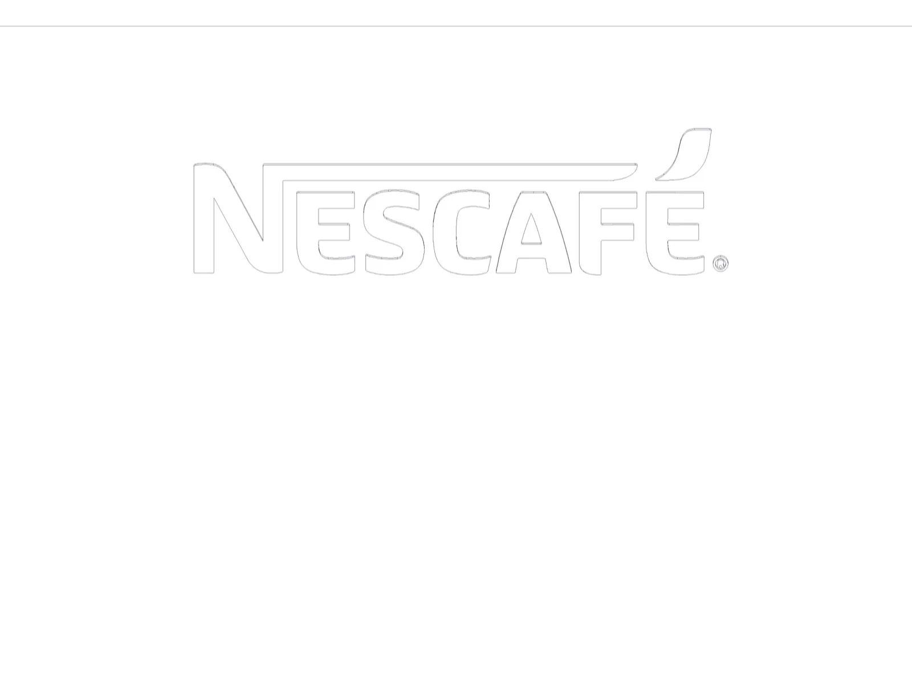
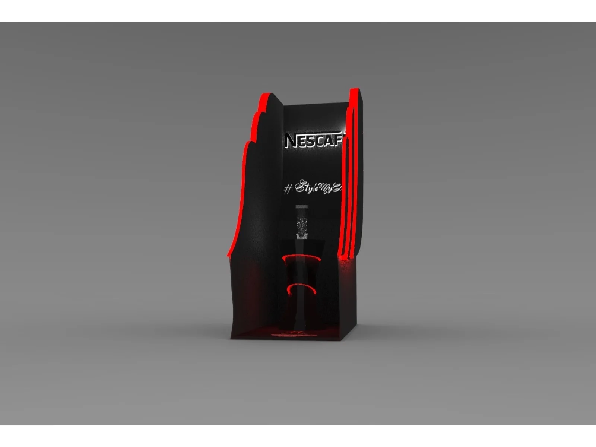
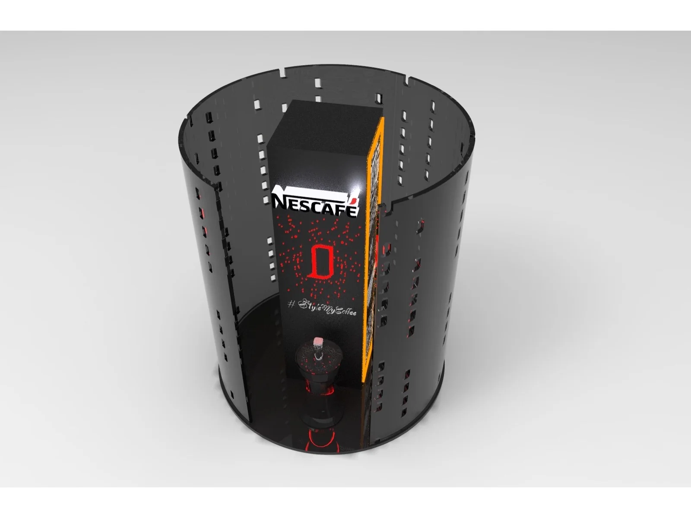
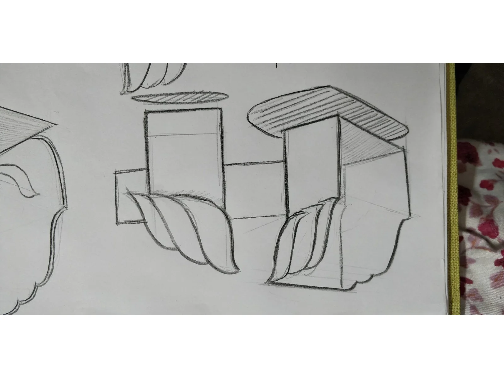

## Overview

Nescafé Connected Coffee Mug was a 2018 retail concept proposal developed around a connected mug product system. The work explored how the product could be encountered beyond the pack or shelf: as a focused retail moment shaped by spatial form, graphic identity, material cues, and sensory engagement.

> **Project status:** concept proposal. The supplied archive contains the presentation, concept sketches, renders, mood-board material, and product visuals. It does not document a built installation, user testing, client approval, or commercial rollout.

## The retail opportunity

The supplied presentation frames the work as three concept proposals, made with the user experience in mind. Rather than presenting the retail environment as a neutral backdrop, the concepts use the product as the centre of an encounter: an object to see, approach, touch, and taste through.

The source material does not preserve a formal research plan, participant evidence, customer journey, site specification, dimensions, budget, or production brief. Those elements are intentionally not reconstructed here.

## My role

- Retail concept development
- Industrial design and spatial ideation
- Mood-board and visual-direction development
- Sketching and concept communication
- 3D concept visualisation

## Setting the visual direction

The mood board brought together flowing forms, tactile natural textures, sculptural silhouettes, and the expressive Nescafé mark. These inputs informed a retail language where organic movement and product display could coexist.

## Exploring spatial concepts

I developed hand-drawn studies to test how a compact product offer could occupy a taller retail structure. The sketches explore enclosure, storage, product visibility, and an approachable interaction zone before the concepts were visualised as retail forms.

## Three concept directions

The archive identifies three proposals. The surviving concept visuals show distinct ways of placing the connected mug at the centre of the retail encounter:

1. **Island display** — a vertical, sculpted enclosure that focuses attention on the product and its preparation moment.
2. **Circular experience** — a wraparound structure with a central product zone and a more immersive perimeter.
3. **Accent-led display** — a direction that uses colour, lighting, and graphic surfaces to create emphasis around the offer.

The descriptions above name visible concept characteristics. The archive does not contain a recorded selection decision, feasibility assessment, or approval outcome.

## Designing for the five senses

The presentation proposed a five-senses framework for the retail experience:

| Sense | Proposed touchpoint |
| --- | --- |
| Smell | Coffee aroma through a fragrance diffuser |
| Sight | Large-scale visuals and product lighting |
| Sound | A Nescafé jingle |
| Taste | Coffee tasting |
| Touch | Direct interaction with the product |

These are experience proposals documented in the presentation, not validated findings. The material does not establish the technical implementation, accessibility, operating model, staffing, hygiene requirements, or measured effect of any touchpoint.

## Experience enhancements

The presentation also proposed additional ways to build theatre around the display:

- spotlighting the product during each reveal;
- using silhouettes of earlier coffee machines to communicate evolution;
- adding coloured, illuminated accents;
- bringing in aged wood or textured surfaces; and
- using a flowing-froth form as a large visual element.

Together, these ideas show an intention to connect a connected product to a more physical, memorable retail ritual. They remain proposal-stage ideas in the supplied material.

## Outcome

The evidenced outcome is a set of three visual retail concept proposals, supported by a mood board, sketches, product visuals, renders, and a sensory-experience framework.

The archive does not document a final design, a commissioned installation, testing, manufacturing, or post-launch performance. The case study therefore presents the work as concept exploration and design communication—not as evidence of a deployed retail experience.

## Credits

- **Shubham Gupta** — Sr. Industrial Designer; retail-concept development and visual communication.
- **Nescafé** — client named in the supplied project presentation and concept assets.
- **Source material** — supplied Nescafé Connected Coffee Mug presentation, concept archive, product visuals, sketches, and mood-board material from 2018.
- **Illustrative asset** — one generated espresso-crema image, added solely as a clearly labelled portfolio atmosphere visual in 2026.
