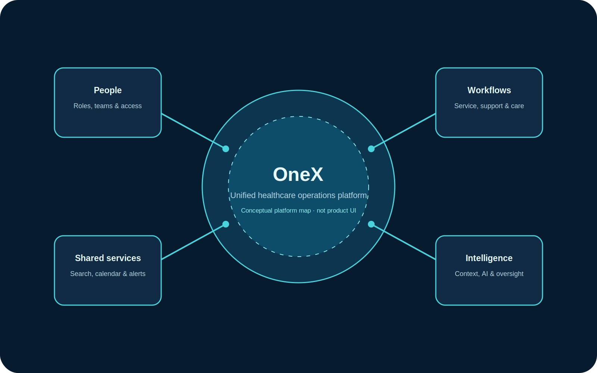

## Overview

OneX is an ongoing, confidential platform-design initiative for healthcare operations. The work establishes a shared foundation for specialised applications so users can move across services without relearning navigation, terminology, or core interaction patterns.

This public case study focuses on the platform rationale and my design contribution. It deliberately excludes confidential product screens, implementation detail, and unverified delivery outcomes.

## The challenge

Healthcare operations span connected devices, service work, user administration, support, and operational oversight. The platform opportunity was to reduce fragmentation without flattening the specialised workflows that different roles depend on.

The design challenge was therefore not to create another standalone interface. It was to establish a platform model that could make shared capabilities coherent, reusable, and trustworthy across applications used in high-stakes settings.

## My role

As Senior UX Designer, I worked across the platform definition: translating operational needs into reusable patterns and helping ensure that specialised applications could retain their domain focus while consuming consistent platform capabilities.

- Product vision
- User and persona work
- Information architecture
- UX principles
- Shared platform services
- Global readiness
- AI experience strategy

## Users and context

The platform serves a connected ecosystem of biomedical engineers, hospital IT administrators, clinical department heads, customer support engineers, and platform administrators.

Their tasks differ, but they share a need for clear status, dependable access to context, auditable actions, and efficient movement between workflows. The experience therefore needed to support high information density without increasing cognitive load.

## Constraints

- The work operates in a high-stakes healthcare context where clarity, safety, traceability, accessibility, and confidence are design requirements.
- Platform capabilities must be shared across applications without forcing every workflow into the same screen or sequence.
- Global deployments require localisation, time-zone handling, and organisational context to be considered as core platform concerns.
- AI assistance must augment expert judgement with explainability and human oversight.
- This public account is anonymised and uses only shareable, platform-level information.

## Discovery

The work combined stakeholder interviews, workflow mapping, design critiques, prototype reviews, and usability testing. These activities helped connect strategic platform decisions to the practical work of operating, supporting, and maintaining healthcare ecosystems.

The public evidence available for this case study supports the activity counts shown above. It does not disclose individual research findings, participant identities, or confidential prototype content.

## Key findings

- **Shared capabilities are part of the workflow.** Search, notifications, support, audit trails, user management, calendars, and localisation cannot be treated as disconnected utilities.
- **Context must persist across applications.** Users need to retain organisation, site, role, time-zone, and object context as they move between tasks.
- **Progressive disclosure is essential to calm density.** Essential operational information should be immediately visible; diagnostic and configuration detail should appear when it is needed.
- **Consistency builds trust in high-stakes work.** Reused patterns for status, navigation, forms, tables, errors, and notifications make complex work easier to interpret.
- **AI needs a governed role.** Assistance must be explainable, context-aware, observable, and subject to human oversight.

## Workflow and information architecture

The platform model starts with connected business objects and complete workflows rather than individual screens. Shared services form the connective tissue: users can discover information, receive notifications, request support, manage access, and inspect an audit trail through consistent patterns.

## Design principles

- Start with user goals and complete workflows, not isolated screens.
- Treat the platform as a reusable product foundation before building feature-specific experiences.
- Make system status, priority, and next actions clear before asking users to investigate.
- Use progressive disclosure to keep information-dense interfaces readable.
- Build accessibility, localisation, and time-zone awareness into the foundations.
- Design AI as transparent assistance that strengthens—not replaces—expert judgement.

## Iterations and validation

The design evolved through 15+ stakeholder workshops, 200+ prototype iterations, and 10+ usability-test sessions with eight participants per session. Design critiques and prototype reviews created a regular feedback loop between the platform strategy and interaction-level decisions.

These figures describe the work performed. They do not represent a claim of product adoption, task-time improvement, or a shipped operational outcome.

## Final experience

The current outcome is an ongoing platform-design direction: a common experience layer that connects shared services with specialised healthcare applications. The target experience supports coherent navigation, object-based information architecture, reusable interaction patterns, and context-aware assistance.

Sanitised visuals will be added later. The image in this case study is an original abstract platform map and should not be interpreted as an application screen or a representation of production software.

## Accessibility and global readiness

Accessibility and global readiness were treated as platform concerns rather than late-stage compliance checks. The direction includes clear information hierarchy, visible system status, accessible interaction patterns, localisation-ready content, and consistent handling of time zones across operational records, notifications, and calendars.

## Design-system contribution

I helped define the UX principles and shared platform direction that enable a consistent design system across applications. This includes foundations for navigation, data display, feedback, forms, content hierarchy, and AI-assisted interactions—so teams can apply the same decisions without recreating them product by product.

## Outcome

OneX remains an ongoing platform-design initiative. The available evidence supports project activity and a five-year revenue potential estimate of €1M+; it does not support a claim that this revenue has been realised.

## Reflection

The central design lesson was that a platform is not a collection of common components. It is a shared commitment to how people find context, make decisions, receive support, and trust the system across every specialised workflow.

## Credits

Confidential healthcare platform initiative. Public case-study copy is anonymised; no organisation names, proprietary screens, or implementation details are included.
