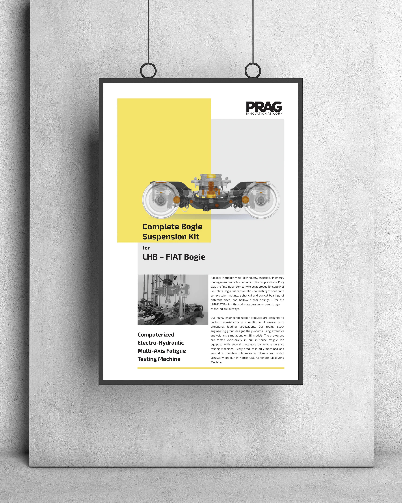
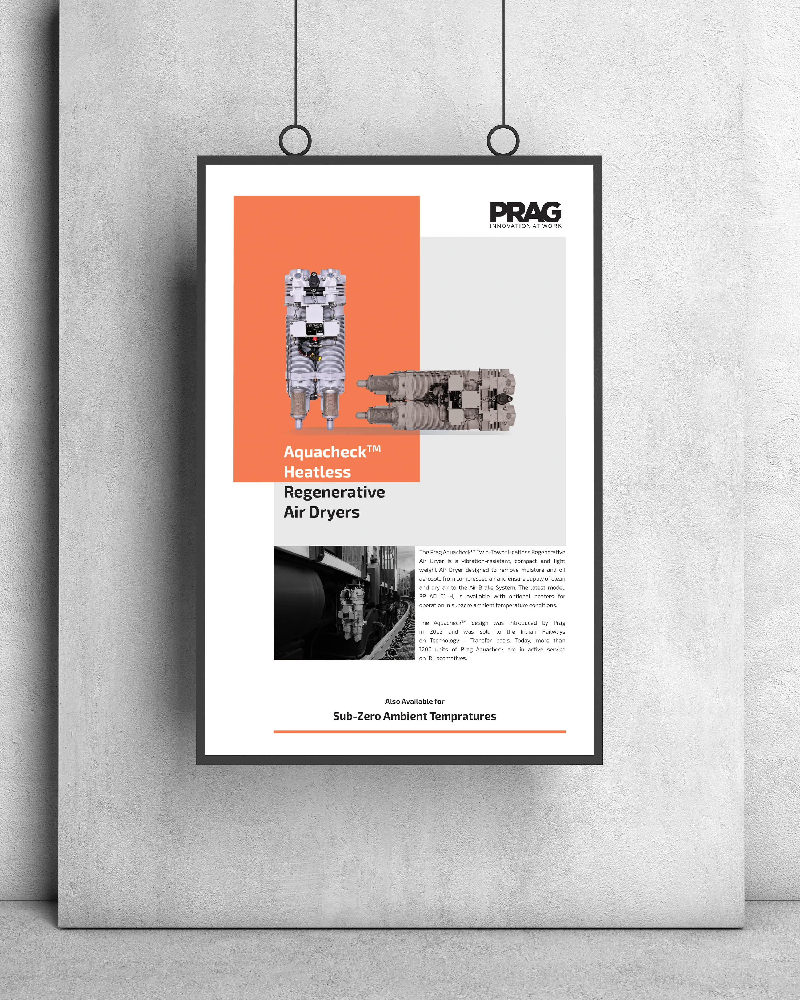
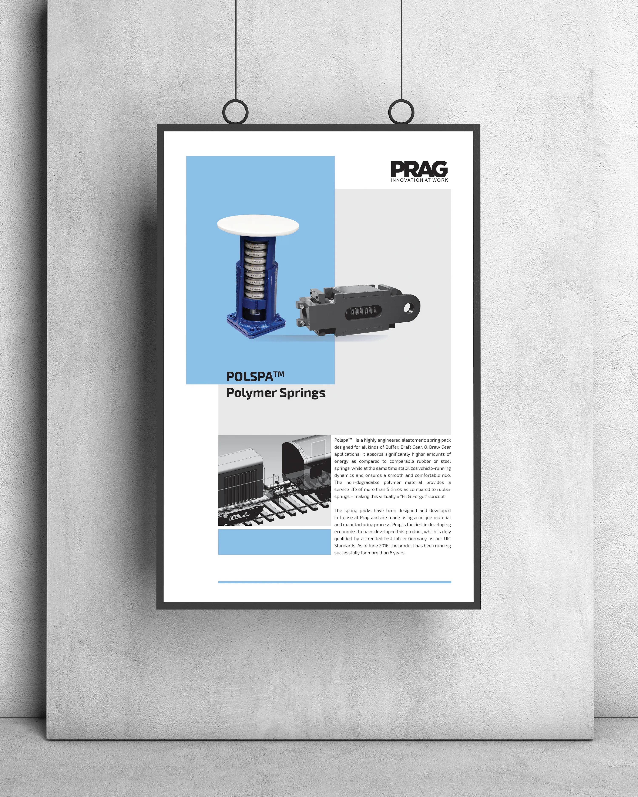
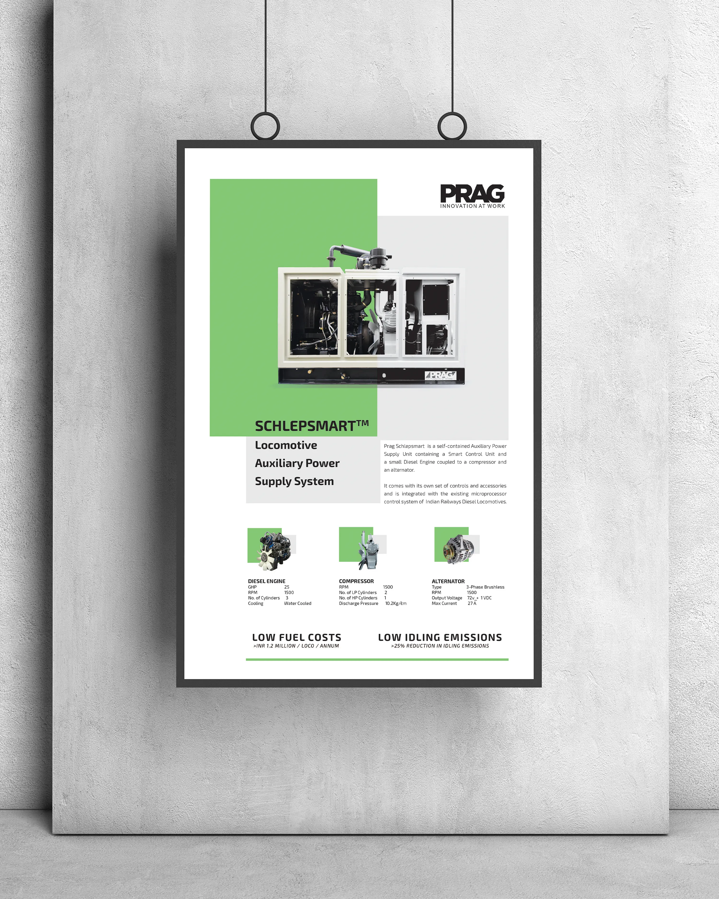
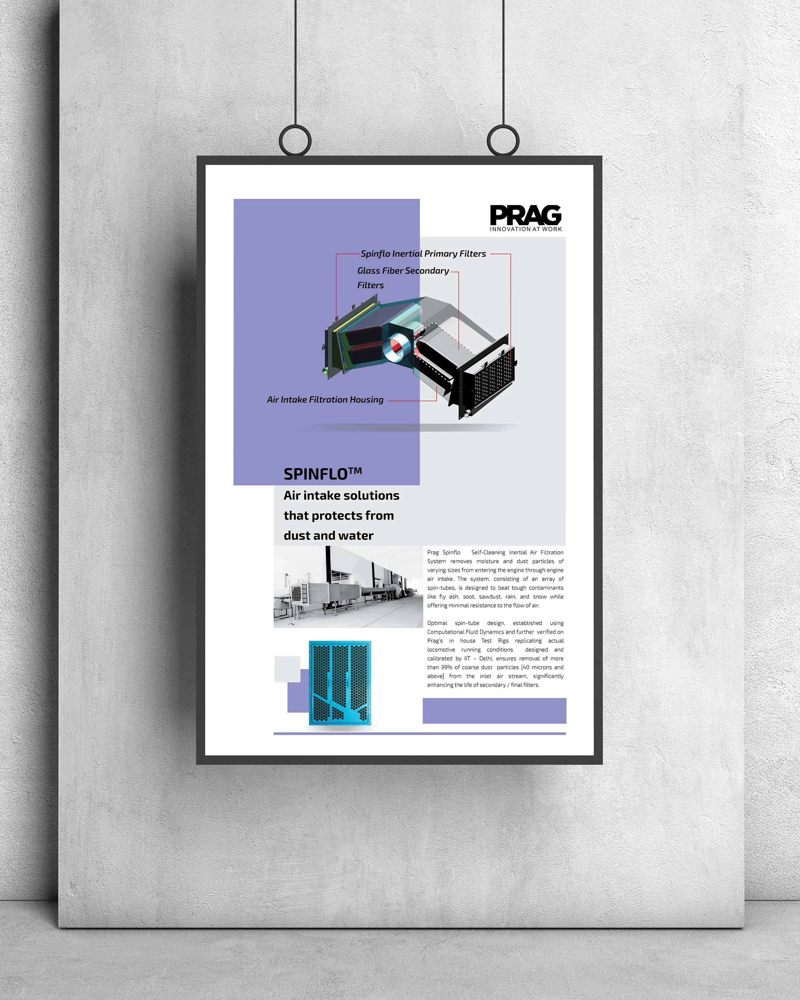

## Marketing poster series

This client project ran for one month in 2017. I designed a public-facing series of marketing posters for Prag Industries India Private Limited (PRAG), for use on office walls, hoardings, and other print media.

## Print production

The primary poster size was 34 × 70 inches; the layouts were designed to stretch to other formats. I worked with the printer to manage print quality. One print of each poster was installed at PRAG's office. No formal client feedback was recorded.

