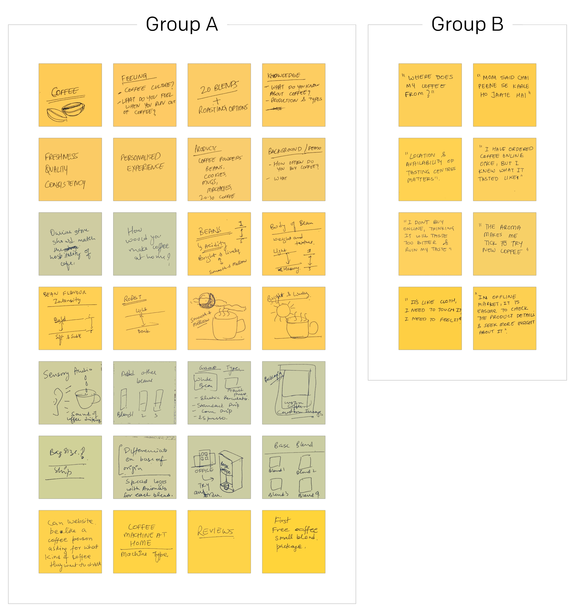
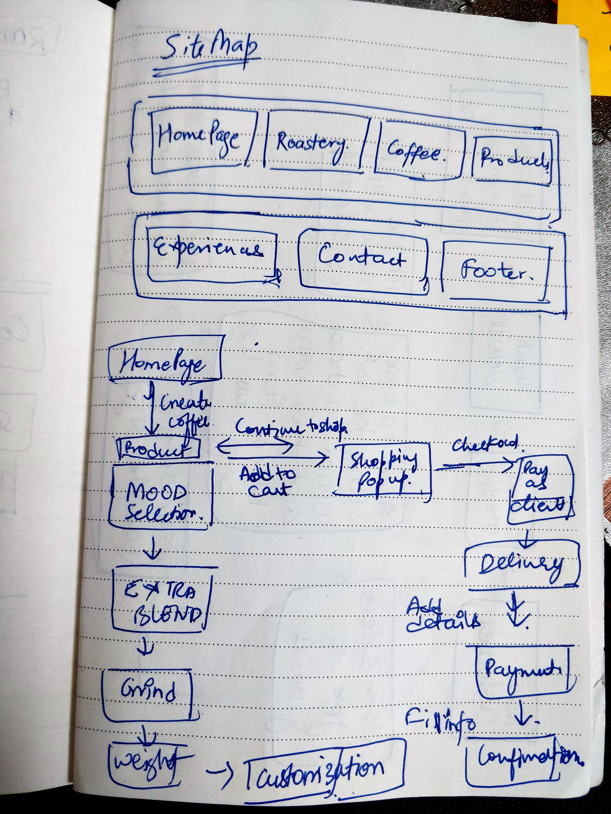
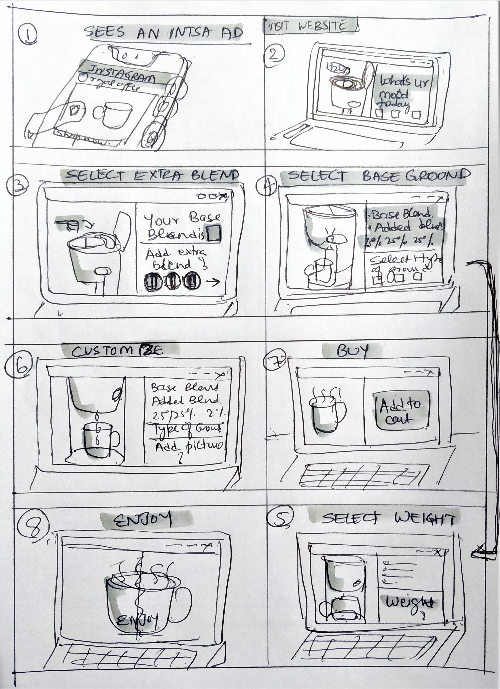
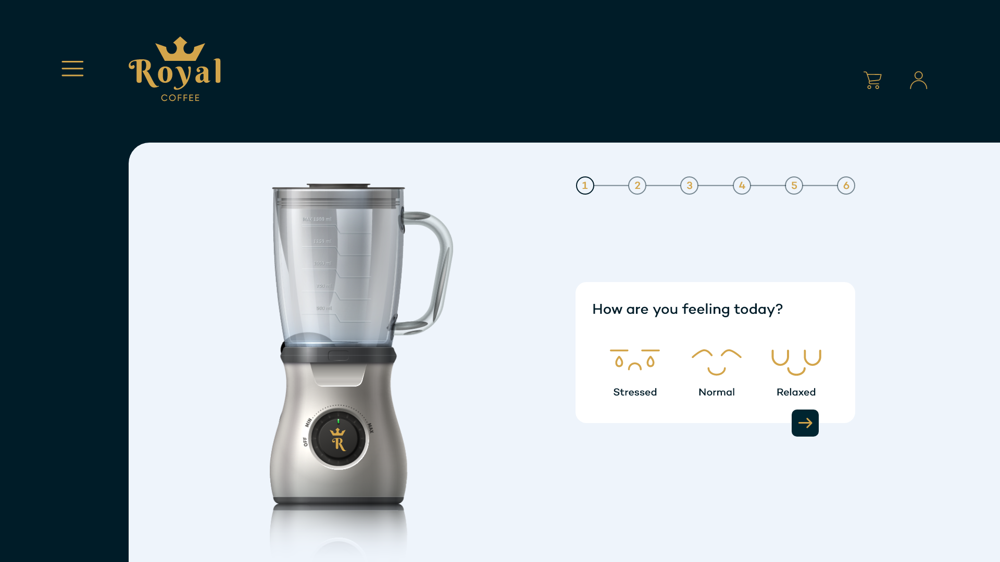
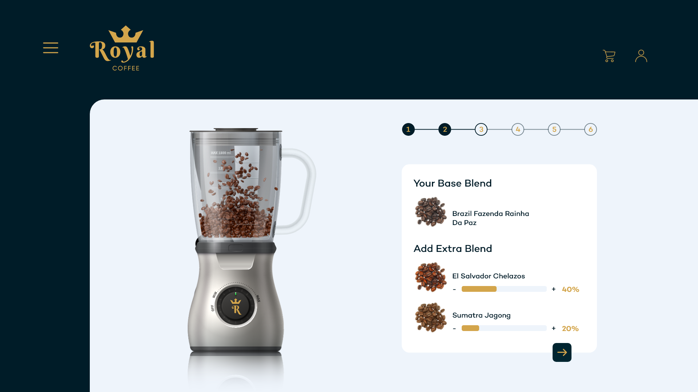

## Overview

**Royal Coffee** is a 2020 UX design-task concept, not a documented commercial launch. The supplied presentation frames the brief around a new coffee brand entering metropolitan markets and differentiating itself through a more personal online buying experience.

The design turns a coffee purchase into a guided sequence: choose a mood, receive a base blend, optionally add other blends, select ground type and weight, customise the bag, and complete the order. The case study preserves the evidence available in the presentation and working photographs; it does not infer product performance, launch status, or business impact.

## The challenge

The task materials identify a central tension: people wanted more confidence in an online coffee purchase, but coffee is usually assessed through sensory cues such as aroma, taste, and physical inspection. The concept therefore needed to help a customer make a choice without treating a large set of blends as an undifferentiated catalogue.

The proposed product also had to support coffee and related products, multiple blends and roasting options, direct consumers as well as larger audiences, and a memorable brand-launching experience. These are brief and concept requirements, not validated product requirements.

## My role

The supplied presentation is attributed to Shubham Gupta. It documents the following design activities:

- Structuring a survey and interview guide around coffee preferences, purchasing habits, and online-buying barriers.
- Translating research material into personas, a journey map, insights, a needs bucket, and design directions.
- Creating task flows, storyboards, a sitemap, wireframes, and high-fidelity concept screens.

The materials do not document team composition, stakeholder involvement, implementation ownership, or a project timeline, so those details are intentionally not claimed here.

## Users and context

The brief identifies corporate people, people working from home, people on dates or hanging out, and people travelling as target audiences across metropolitan and tier 1 / tier 2 cities. The research synthesis shown in the presentation focuses most closely on two customer archetypes:

- A coffee enthusiast who values taste, social discovery, and speciality coffee.
- A working professional who needs a quick, dependable way to buy coffee within a routine.

The concept assumes an online purchase journey, often starting from social media or web search, and supplements it with the possibility of a physical tasting-centre touchpoint.

## Constraints and evidence boundary

The supplied materials show a design-task process and concept artefacts. They do not provide evidence for a production release, conversion, retention, revenue, accessibility audit, usability-test results, or a live prototype.

The source record also does not establish participant recruitment, consent, raw responses, interview count, demographic breakdown, or whether the 41-person survey was representative. The figures and quotes are therefore presented as inputs to the concept, not as generalisable research findings.

## Discovery

The presentation records a mixed discovery approach: a 13-question survey with 41 participants, a user-interview guide, benchmarking, personas, a journey map, brainstorming, and synthesis into design directions. The qualitative material highlighted uncertainty about coffee origin, taste, aroma, and whether an online choice would be enjoyable without touching or tasting the product.

## Key findings

- **Make coffee easier to understand.** The presentation calls for categorising a large blend range and explaining attributes such as acidity, body, origin, roast, and flavour intensity.
- **Reduce the risk of buying without sensory cues.** Recorded quotes point to a desire for better product details, validation, reviews or ratings, and possible tasting-centre or sample experiences.
- **Offer a personal route into selection.** The concept uses mood selection as a shortcut to a base blend, then gives the customer control over added blends, ground type, weight, and bag personalisation.

## Workflow or information architecture

The sitemap separates the experience into Home Page, Coffee, Coffee Products, Experience, My Account, and Footer. Under the coffee path, the documented flow proceeds from **Coffee Product** to **Mood Selection**, **Add Extra Blend**, **Choose Grind Type**, **Choose Weight**, and **Customise / Add Picture**. Shopping then continues through cart, checkout, delivery, payment, and confirmation.

The storyboard also captures the experience from discovery to purchase: seeing a social-media ad, visiting the site, selecting a mood, choosing a base and extra blend, customising the product, choosing weight, adding it to the cart, and enjoying the coffee.

## Design principles

- **Start with an understandable decision.** Use mood as an entry point before exposing blend-level choices.
- **Balance recommendation with control.** Suggest a base blend while keeping adjustment of extra blends, grind, and weight visible.
- **Bring the physical product into the digital experience.** Use product imagery, packaging personalisation, and machine-inspired visuals to make the experience feel less abstract.

## Iterations and validation

The materials document at least two concept iterations in the storyboard: an earlier flow focused on creating a new blend through physical coffee attributes, followed by a mood-led flow with optional added blends and personalised packaging. It also includes wireframes and high-fidelity screens.

No usability sessions, task-completion data, design review notes, or post-launch results were supplied. The final visuals should therefore be read as a concept exploration rather than a validated final product.

## Final experience

The final visual direction uses a dark navy and gold Royal Coffee brand frame with large product imagery. The entry screen invites the customer into a personalised coffee journey; subsequent screens show mood selection and a base-blend configuration with optional additions.

## Accessibility

No accessibility requirements, audit, or validation evidence appears in the supplied materials. Before implementation, the concept would need accessible names and keyboard paths for mood and blend controls; text alternatives for product visuals; sufficient contrast; non-colour indicators for selection state; and clear summaries of price, blend composition, grind, and weight before purchase.

## Design-system contribution

The supplied visual work demonstrates a reusable concept direction rather than a documented design system: a dark-navy canvas, gold accent colour, rounded white content panels, a multi-step progress treatment, product cards, choice controls, and branded packaging imagery. No token library, component specification, or production design-system handoff is included in the available evidence.

## Outcome

The evidenced output is a coherent UX design-task concept and a set of supporting artefacts: research summary, personas, journey map, ideation, task flows, storyboards, sitemap, wireframes, and high-fidelity screens. The material does not establish that Royal Coffee was built, tested with users, or launched.

> Evidence note: 41 survey participants, 13 questions, two personas, and a 20-blend concept scope are recorded in the supplied presentation. They describe the project inputs and scope, not product impact.

## Reflection

This project demonstrates how a sensory, high-consideration purchase can be translated into digital decision support. The enduring design lesson is to make a complex catalogue easier to enter while preserving customer control: a recommendation can create momentum, but the customer must still understand and adjust what they are buying.

## Credits

Design-task materials and working photographs supplied by Shubham Gupta. Royal Coffee is presented as the design-task concept described in the source presentation. The referenced benchmarking brands, visual inspiration, and product imagery remain subject to their respective owners; their usage and licensing are not documented in the supplied materials.
