## Overview

Zero Brush was a six-month academic Design Thinking project completed by a four-person team at ISDI. We moved from a broad investigation of urban waste in Mumbai to a physical toothbrush concept built around two ideas: detach the part that wears out, and make morning-and-night use visible through a pellet-dispensing interaction.

The outcome was a **functioning academic concept prototype**, not a production-ready oral-care product. The supplied evidence documents research and synthesis, physical models, CAD, 3D-print preparation, mechanism development, two-participant formative testing, videos, and final renders. It does not establish environmental, clinical, material-safety, durability, manufacturing, or commercial performance.

### My role

I was the **Industrial & Product Designer in a four-person team**. I led product form development, ergonomics, physical mockups, CAD/3D modelling, rendering, 3D-print preparation and video production, while contributing to research and formative testing.

## Situation

The project began at the scale of Mumbai's waste system. Our team observed and shadowed campus cleaning staff, spoke with garbage collectors, and documented the actors, behaviours, and disposal conditions surrounding everyday waste. The archive does not preserve a defensible total participant count, so the research is described by method rather than by an invented sample size.

### From the waste system to an everyday object

An early research-framing matrix separated what the team already knew from what still needed investigation, then recorded risks and opportunity areas. It shows the breadth of the inquiry before the team narrowed the brief to toothbrush disposal and brushing routines.

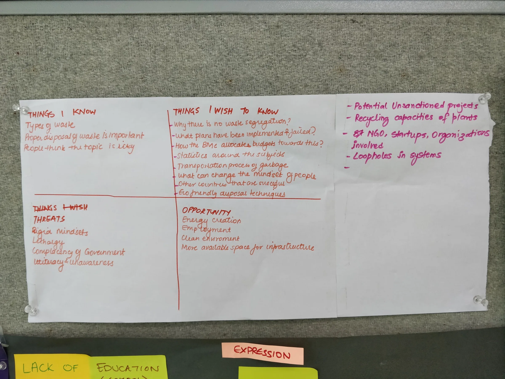

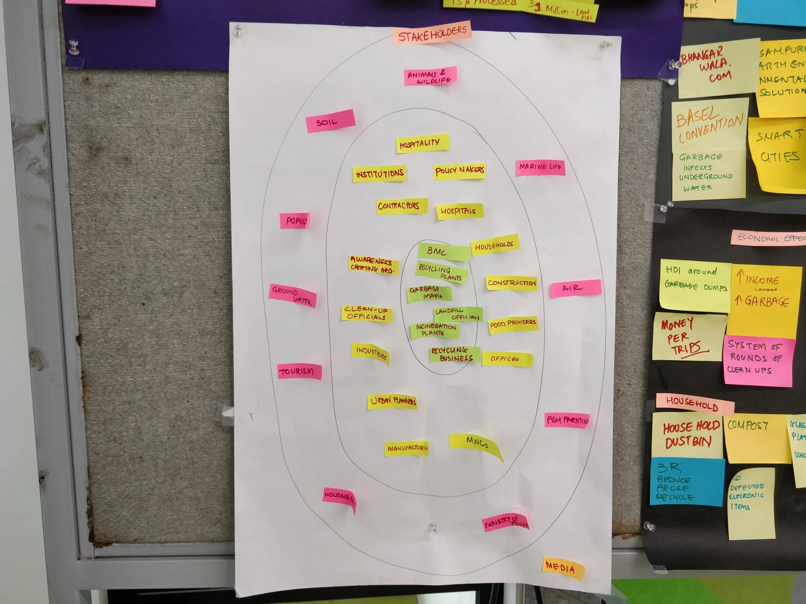

## Evidence

The project records three recurring qualitative patterns:

- People knew twice-daily brushing mattered, but knowledge did not always become routine.
- Brush replacement was often triggered by visible bristle deformation rather than a planned interval.
- Toothbrush waste was less salient to participants than plastic waste in general.

These findings came from the surviving interview material, observation records, and synthesis artifacts. Some documents are research plans rather than proof that every planned conversation occurred, so the case study does not claim a total interview count.

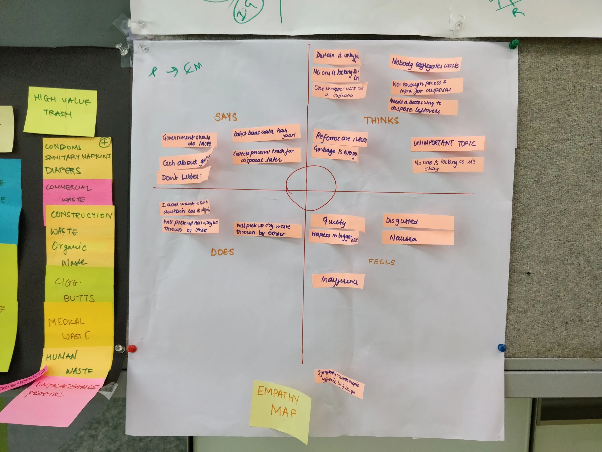

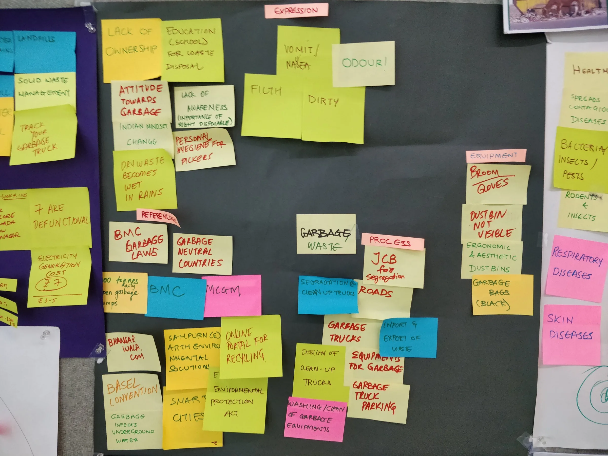

### Human factors and physical constraints

Adding a detachable head, storage channel, and slider to a familiar object introduced new constraints: head stability, grip comfort, reach to the control, refill access, internal clearances, and reliable single-pellet release.

An early scale study placed reference toothbrushes beside a ruler. It helped the team judge overall length and proportions, but it was not a formal anthropometric or ergonomic validation.

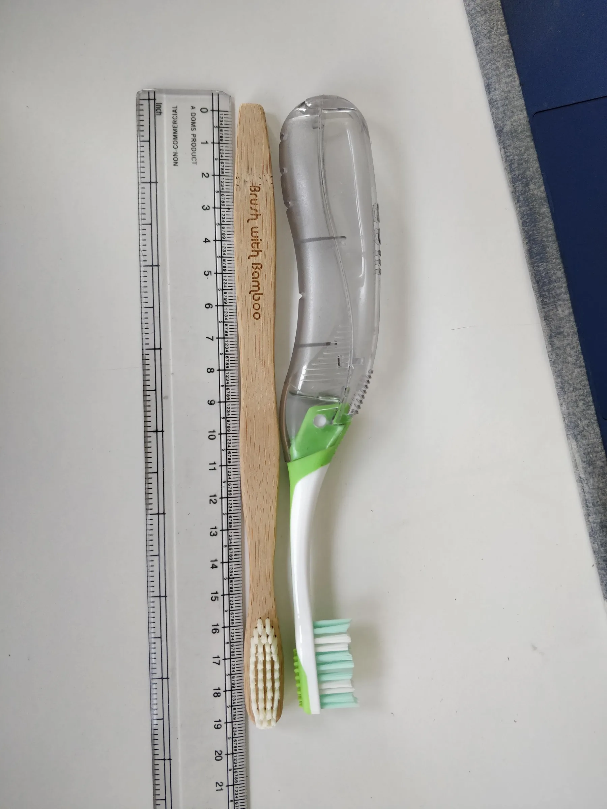

## Insight

Replacing less material addressed only one part of the opportunity. The concept also needed to make two otherwise invisible moments legible: **when the head should be replaced** and **whether morning and night brushing had occurred**.

That reframed the challenge from a single detachable component into a combined product-and-routine system. The body would hold the interaction, while the head and toothpaste pellets would remain separable elements.

## Design decision

The source archive contains **39 documented ideas** across product forms, behavioural prompts, apps, replacement indicators, mouth-cleaning concepts, and toothpaste alternatives. Four directions advanced into the team's desirability, viability, and feasibility exercise:

| Shortlisted direction | Team DVF total |
| --- | ---: |
| Detachable brush heads | 23 |
| Toothpaste pellets | 18 |
| Oral-hygiene app | 16 |
| Mouth-cleaning puck | 11 |

These scores were a team selection tool, not user-preference or market-validation metrics. The direction taken forward combined the highest-scoring detachable-head idea with the pellet concept's morning-and-night cue.

### Mechanism and form exploration

Sketches explored head joints, refill points, day/night channels, side-lock actions, slider positions, grip profiles, and a supporting holder. They are evidence of exploration, not proof that every mechanism shown was built or functional.

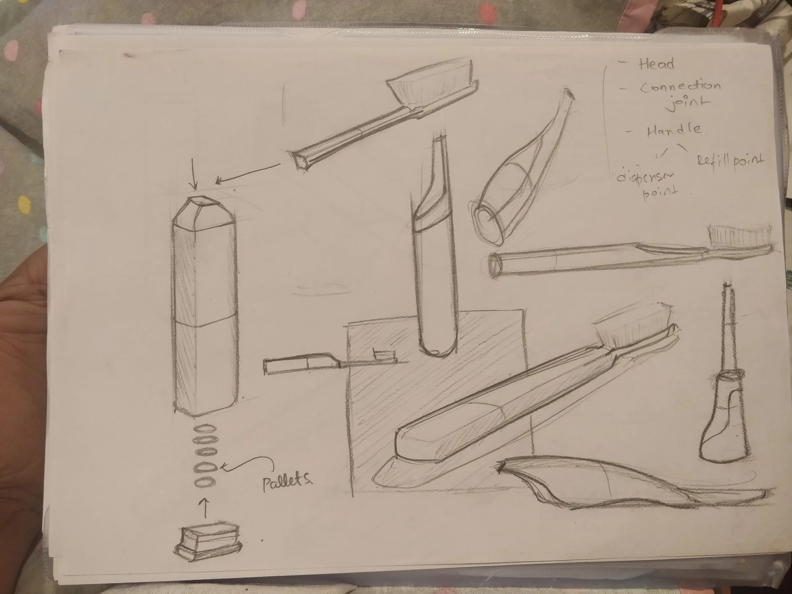

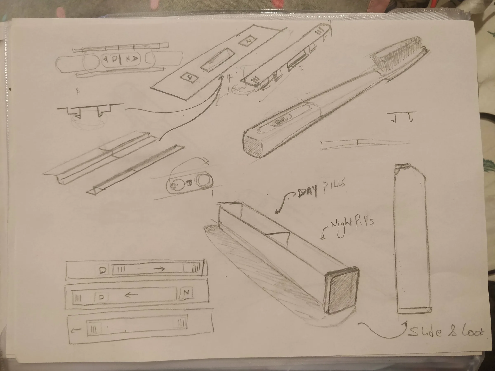

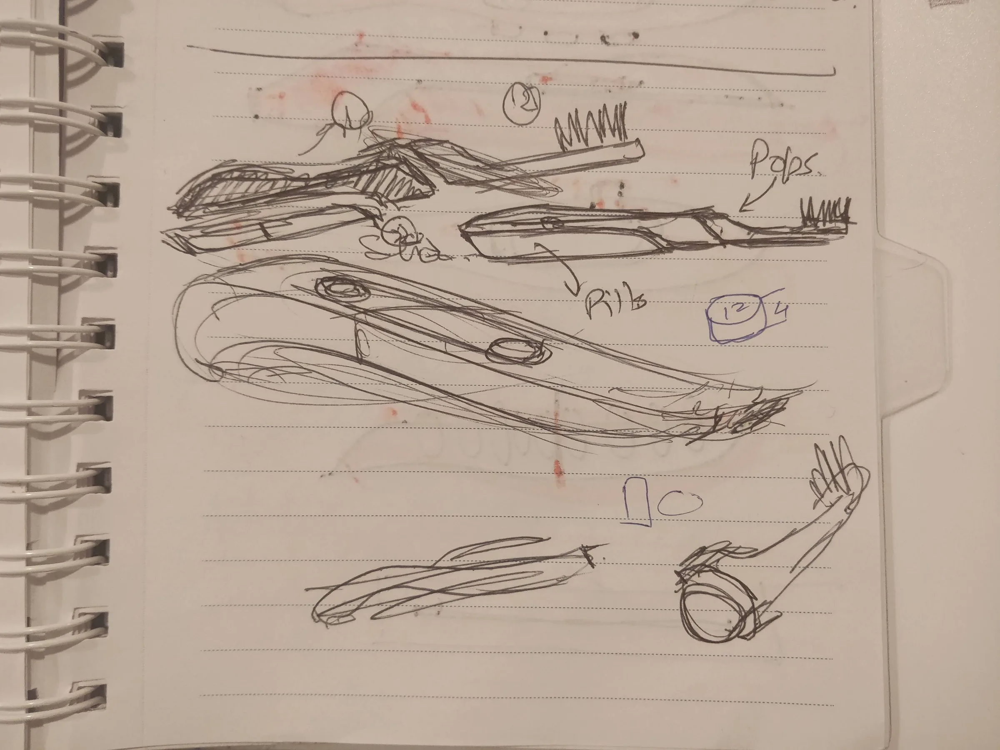

### Materials and fabrication boundary

The fabricated study used a **3D-printed body, bamboo head, mixed bristles, and toothpaste-pellet models**. These artifacts let the team study fit, attachment stability, dispensing, handling, and participant response. They did not establish biodegradability, ingredient safety, production feasibility, or lifecycle benefit.

The project archive also contains changing material proposals, including wood-finished renders and recyclable-plastic descriptions. They are treated here as design directions rather than as one verified production specification.

## Artifact

Two prototyping phases moved from fast physical studies to an integrated head, body, slider, and pellet-access mechanism. The early physical build made assembly and human scale tangible before the form was refined digitally.

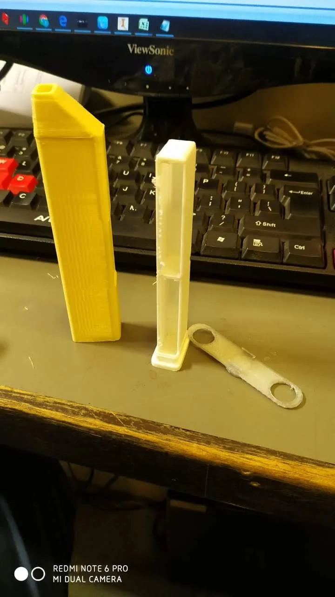

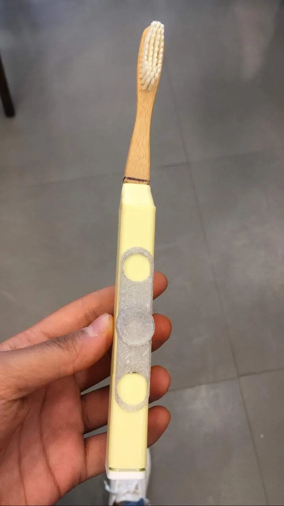

### CAD, assembly, and form development

CAD work translated the body, head connection, internal channels, and slider into components prepared for 3D printing. A recorded CATIA assembly sequence formed part of the project's video output and preserves the mechanism development in context.

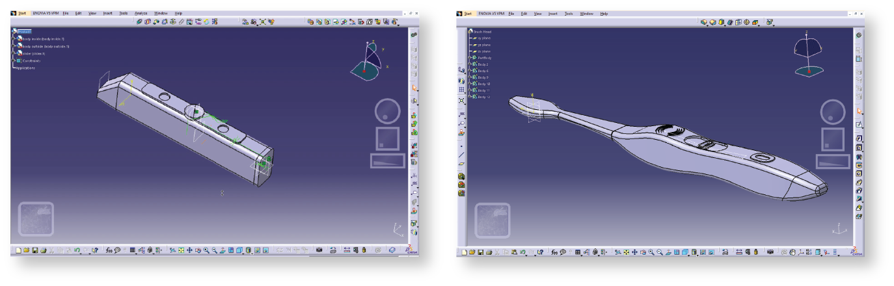

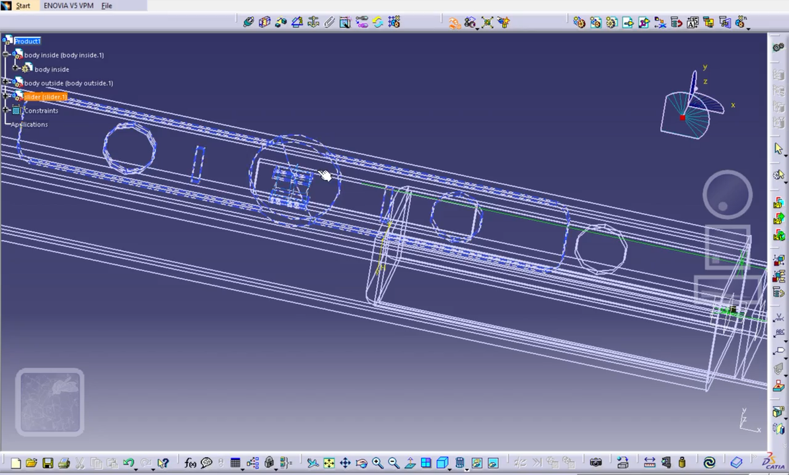

The visual direction evolved through basic physical models, an alpha mechanism, a translucent product family, and the later wood-finished Zero Brush presentation.

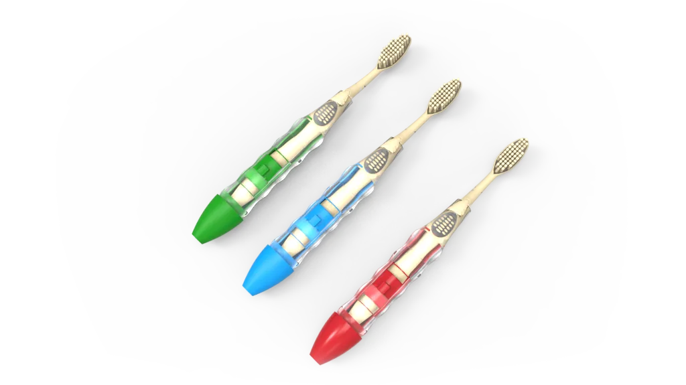

The earlier academic presentation used the name **S.T.R.I. — Sustainable, Trackable, Replaceable, and Incentivised**; the later case-study article is titled **Zero Brush**.

### Intended architecture

The proposed architecture separated the detachable head, main body, slider plate, pellet tray, and internal pellet sequence. The exploded and detail renders communicate design intent; they are not production specifications.

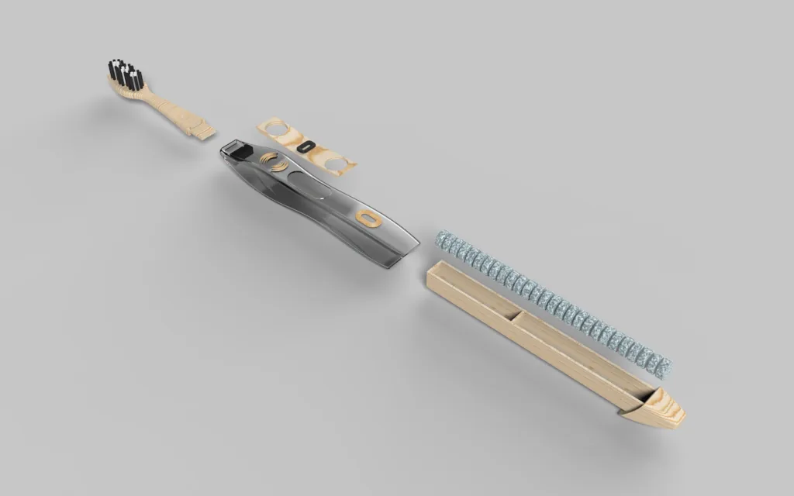

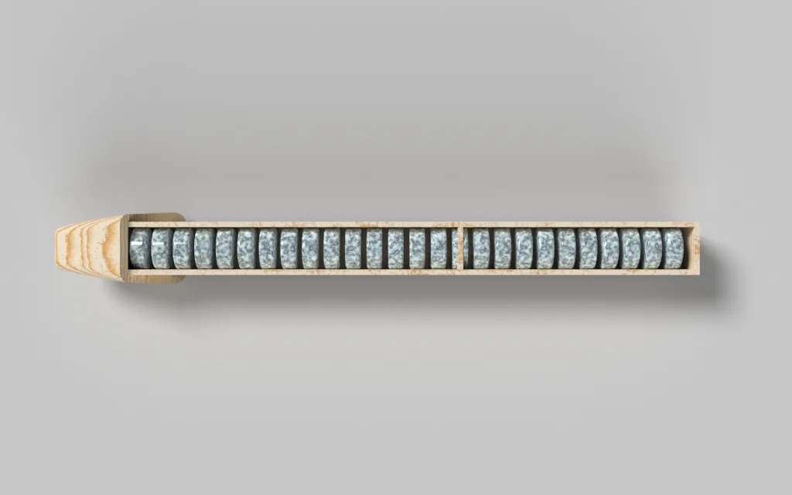

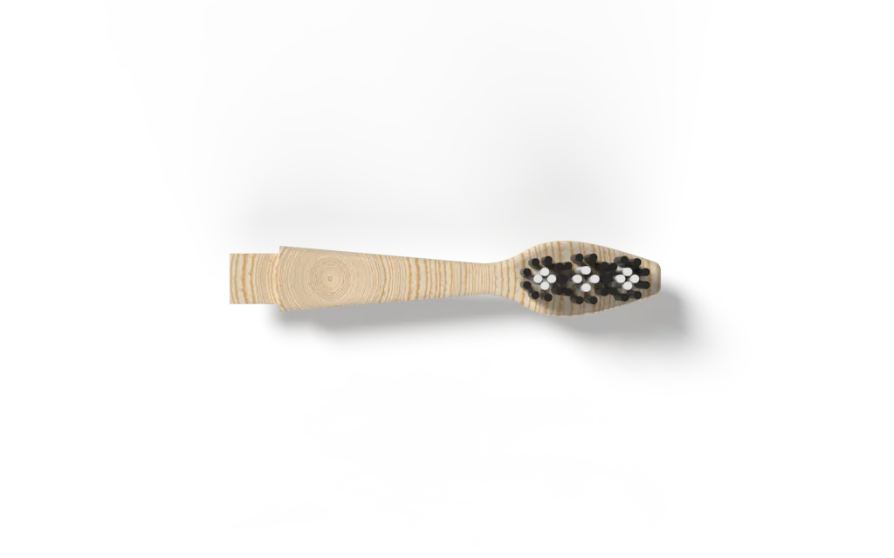

## Prototyping and validation

Two participants tried the fabricated prototype. The evaluation was small and formative: it examined fit, head stability, dispensing, handling, and response to the day/night interaction rather than durability, clinical efficacy, ingredient safety, or long-term habit change.

The documented feedback identified four issues:

- The head connection could wobble.
- The body and slider needed better ergonomics.
- More than one pellet could dispense together.
- The integrated form did not yet feel as comfortable as a familiar toothbrush.

One participant reported that the day/night capsules helped them brush twice in a day and described the pellets as fun to use. This single qualitative reaction is not evidence of sustained behaviour change.

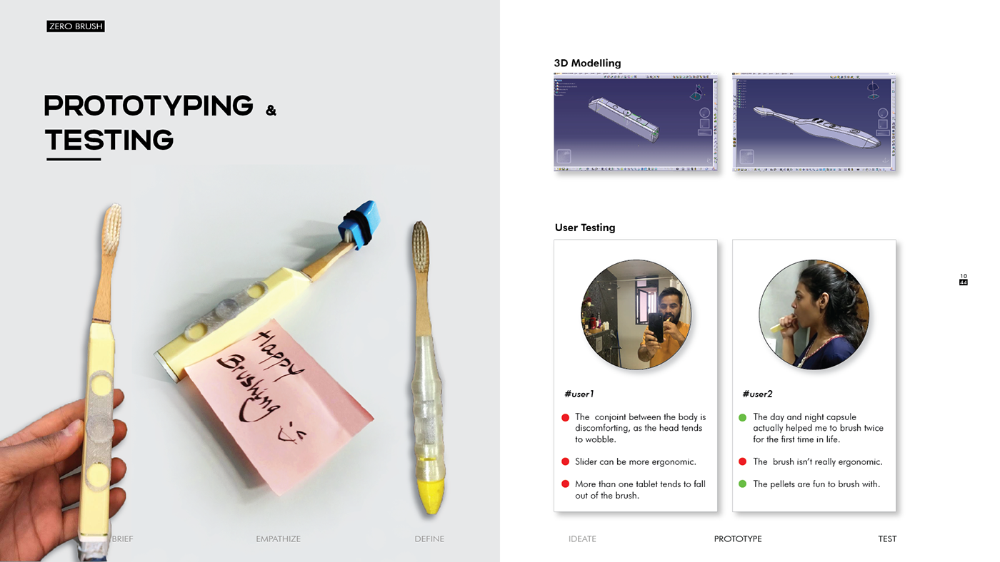

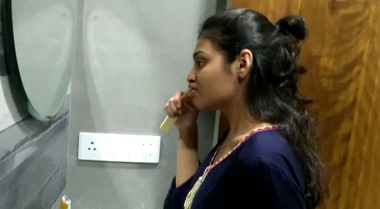

### What changed—and what did not

The next build tightened the attachment tolerance between head and handle and revised the slider mechanism. The available project archive documents the initial problems but does not contain a formal, measured post-fix validation report.

The multi-pellet dispensing problem remained unresolved. Durability was not tested, and no claim is made for hygiene or cleanability performance, clinical efficacy, ingredient safety, environmental performance, production readiness, adoption, or commercial impact.

## Outcome

The final CAD direction developed the product form and communicated the intended interaction through a transparent body, visible controls, separable elements, and system renders.

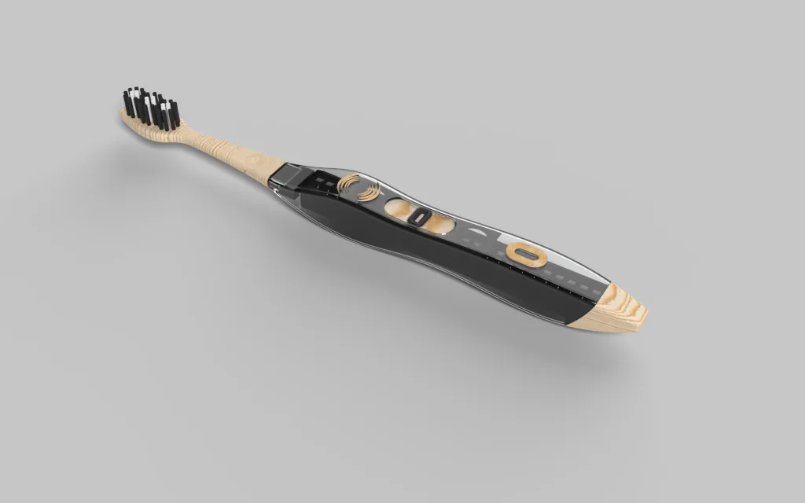

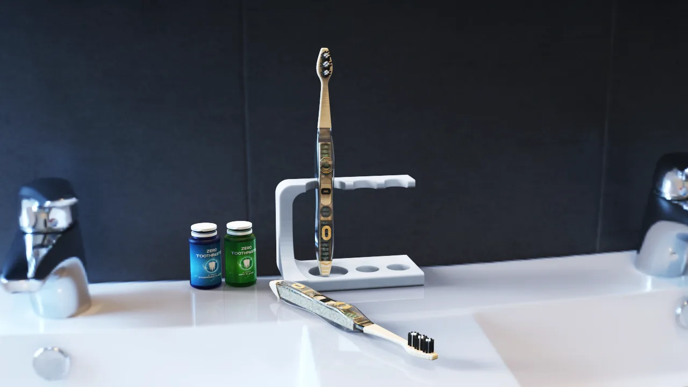

**A functioning academic concept prototype with a refined head attachment and slider mechanism, fabricated material and pellet models, CAD development and final renders. The multi-pellet dispensing issue remained unresolved, and commercial, clinical and environmental impact was not validated.**

## Reflection

The project showed that adding a behavioural cue to a familiar object also adds mechanical and ergonomic failure modes. The concept became more credible when the head joint, slider, and dispensing sequence were treated as one interaction rather than as independent features.

A responsible next phase would redesign the single-pellet release, retest the revised mechanism with a larger and more varied participant group, run controlled durability studies, review pellet ingredients and clinical safety with qualified experts, establish a coherent production material specification, and conduct lifecycle and manufacturing assessments before making environmental or commercial claims.

## Credits

- **Design team:** Pooja Doshi, Anna Abraham, Raj Vichare, and Shubham Som Gupta
- **Shubham's contribution:** product form development, ergonomics, physical mockups, CAD/3D modelling, rendering, 3D-print preparation, video production, research contribution, and formative testing
- **Academic mentors:** Amit Kundal and Deepak Singh
- **Context:** ISDI, Mumbai · 2019

All displayed visuals were selected from the supplied project archive or generated as stills from supplied project videos. Downloaded reference assets and licence-unclear stock composites were excluded; identifiable imagery was published only where consent or redaction was documented.
